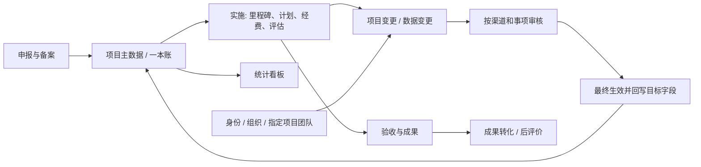

# 项目变更：资料理解与需求对照

本次输入目录为 `/home/dev/research_platform`，其中是三份业务资料；已部署源码位于 `/home/dev/projects/ZGSFkeyan-yuyanplatform`。本次基于已部署仓库直接改造原 `/implement/change` 页面。三个原始 Office 文件均未改写。

## 1. 资料分工与格式

| 文件 | 格式与结构 | 对本次开发的约束 |
| --- | --- | --- |
| 科研项目信息化管理平台需求V19_1.docx | OOXML，正文、表格、图片；封面为 2026 年 7 月 | 业务边界、项目层级、工作定责、渠道差异与审批规则 |
| 经营管理类系统统一UI风格规范.pptx | OOXML，35 页，含文字、主题和界面图片 | 沿用 Ant Design Vue，统一导航、列表、抽屉、操作和间距 |
| 附件1.预先研究项目信息-表头-项目处.xlsx | 两个工作表“总表”“下拉选项”；总表 A:AK 共 37 列、合并表头和填写说明 | 字段语义、金额单位、年月格式、专业与渠道下拉内容；不是数据库结构定义 |

提取结果保存在本地 `deploy/change/source/`：`requirements.txt`、`ui-slides.txt`、`spreadsheet.txt`、`manifest.json`。Word 的 `Pxxxx` 是 `word/document.xml` 中段落顺序编号，包含表格段落和空段落，不是 Word 页码。原文件校验值：

| 文件 | 字节数 | SHA-256 |
| --- | ---: | --- |
| DOCX | 4251464 | `f577d1b9985db6714a466eb258eb6b721fc5d9740c89807896508a6f0cd33bc6` |
| PPTX | 16045543 | `cb82aea0038c52fea5c70ca3acfbc83421a4650132ebd0430a35355eccabf1d3` |
| XLSX | 15606 | `ecf983859df9d10b6ccc623dbc1ebae02668c8b46d67ff9942c8f5721da4e728` |

## 2. 整个平台如何理解

平台是科研项目全生命周期管理与汇总平台，定位是统筹归集、宏观管控，向科研数智看板提供源头数据。一本账以项目为中心串联立项、实施、验收，向成果转化、后评价和合作单位评价延伸。国家级、地方级、公司级是层级，MJKY、04 专项、科技创新行动等是渠道，二者不能混同。系统同时有项目业务、经费账、项目团队/工作定责及系统权限四组约束。

前端 `Vue 3 + TypeScript + Ant Design Vue + Pinia`，页面使用现有 hash 路由和布局。后端 `Spring Boot + Java 17`，常规模块使用 MyBatis-Plus；变更模块使用 JDBC 显式事务以完成多表审批、锁定与回写。MySQL 存业务，Redis 存 JWT 会话，MinIO 存材料。详见上一轮形成的 [平台架构与本地部署](../平台架构与本地部署.md)；该文档中的旧变更行为由本次文档补充替代。

## 3. 需求到实现

| 编号 | 依据 | 需求理解 | 本次实现 |
| --- | --- | --- | --- |
| C01 | P0316、P0839 | 两类变更入口 | PROJECT / DATA；目标字段决定类型和事项，后端拒绝降级绕过法务 |
| C02 | P0839 | 实施阶段调整 | 仅 IMPLEMENTING、DELAYED 项目可发起/继续生效 |
| C03 | P0840–P0842 | 内容、缘由、支撑材料 | 必填标题、原因、目标和新值；先保存草稿，真实上传附件，再提交 |
| C04 | P0841 | 逐级审核 | 草稿 → 单位节点 → 后续节点；不能一次点击结束全部流程 |
| C05 | P0841 | 外协、总经费、整体周期强制法务 | 三类事项插入独立 LEGAL 节点；法务有指定办理人、意见和履历 |
| C06 | P0854 | 国家级 MJKY 上报 GXB | 总部通过后进入待线下归档，须附件及文号/回执号，归档后生效 |
| C07 | P0884 | 科技创新行动单位终审 | 普通项目变更仅单位终审；重大事项仍保留法务约束 |
| C08 | P0909、P0914 | 联盟、波音单位内部两步 | 单位科技主管初审 → 单位主管部长确认；重大事项中间插入法务 |
| C09 | P0842 | 数据纠错总部科技主管确认 | 单位主管初审 → 总部科技主管确认，部长不能替代该确认节点 |
| C10 | P0159 | 层级特殊调整 | DATA 的“层级 / 渠道特殊调整”；选择渠道，回写渠道 ID、渠道名和层级 |
| C11 | 工作定责、现有指定项目人员 | 发起与办理人有边界 | 项目成员、组织和节点身份共同校验；系统管理员业务只读；禁止自审 |
| C12 | 一致性与可追溯性推导 | 审核不得覆盖并发新值 | 版本号、行锁、创建幂等键、原值校验、最后节点事务回写 |
| C13 | 操作闭环推导 | 驳回可补正 | 保留驳回意见及原履历；编辑后重新从第一节点提交 |
| C14 | 历史数据兼容 | 旧记录没有目标关联和完整履历 | 显示“历史”只读，不推断旧数据并自动回写 |

### 需要明确的解释与边界

1. P0841 同时有“单位→总部”和“一般变更单位终审”的文字；采用后附渠道表的明确流程优先。未给出变更细则的 FGGGXJC、ZDZX，以及表格为“/”或不明确的 KJZ、DFJYJY，暂用通用“单位→总部”。这些是当前实现口径，不代表资料已明确规定。
2. 现有账号体系没有独立“法务”身份。采用“每份重大申请指定在岗现有人员”为法务办理人，管理员、公司领导和发起人不能被指定；原岗位仍保留。没有修改全平台角色矩阵。尚未落实专职法务名册和任命资格；如业务要求限定名单，应在本模块进一步收窄候选人。
3. 技术负责人可填报；其草稿可由项目中指定的负责人确认提交。其他非作者不能编辑该草稿。实际按钮以服务端返回的权限为准；原工作定责条保留作为通用职责提示。
4. MJKY 的线上归档记录真实附件与回执信息，不模拟调用 GXB；真实性由归档人和管理流程负责。
5. 需求要求整个实施阶段只有变更一个调整入口，但用户要求不修改其他部分。本次保证**变更模块自身**的受控生效，未改动其他页面/接口原有编辑功能，不能据此声称全平台已经封堵全部旁路写入。
6. 现有项目核心指标存于 `proj_info.goal`，没有独立指标明细模型；外协单位使用现有 `proj_participant`，没有新增合同审批平台；付款节点使用未完成的 `proj_plan`，不会改写已发生付款的会计日期。
7. 每份申请处理一个明确字段/业务对象。涉及多字段时分单申请；跨单调整先后顺序要满足日期和经费约束。没有实现多目标原子变更包。

## 4. 渠道流程矩阵

| 类型 / 渠道 | 普通事项 | 重大事项 |
| --- | --- | --- |
| DATA / 全部渠道 | 单位初审 → 总部科技主管确认 | FUND/PERIOD/OUTSOURCE 不接受 DATA 类型 |
| PROJECT / MJKY | 单位初审 → 总部终审 → GXB 归档 | 单位初审 → 法务 → 总部终审 → GXB 归档 |
| PROJECT / SHKJCX | 单位终审 | 单位初审 → 法务 → 单位终审 |
| PROJECT / CLM、BOKH | 单位科技主管初审 → 单位部长确认 | 单位科技主管初审 → 法务 → 单位部长确认 |
| PROJECT / 04ZXJX、ZDYFJH、XX25、ZRJJ、SHJBGS、YYGD、XJQX | 单位初审 → 总部终审 | 单位初审 → 法务 → 总部终审 |
| PROJECT / FGGGXJC、ZDZX、KJZ、DFJYJY | 暂用通用单位初审 → 总部终审 | 暂用通用单位初审 → 法务 → 总部终审 |

## 5. 表格资料的字段口径

总表第 1 行标题，第 2 行分组，第 3–4 行多级列名，第 5 行填写说明。不是从首行即可直接读字段的平铺 CSV。

| 列 | 含义 | 对应与处理 |
| --- | --- | --- |
| A | 序号 | 展示序号，不作为数据库主键 |
| B、C | 级别、来源/渠道 | `level_code`、`channel_id/channel_name`；特殊变更联动 |
| D | 项目类型 | `project_type`；本次不新增此字段的变更入口 |
| E、F | 一级/二级专业 | `major1`、`major2`；保持现有导入和字典 |
| G | 项目名称 | `name`；DATA 基本信息纠错 |
| H、I | 管理/需求单位、责任单位 | 按现有主数据与合作单位语义处理，不能把外部责任单位当作登录组织 |
| J、K | 项目状态、验收状态 | 系统流程结果；不允许通过自由文字变更绕过验收 |
| L | 负责人 | 账号/团队定责，不凭表格姓名授权 |
| M、N、O、P | 立项年月、开始年月、结束年月、周期（月） | 表格为 XXXX.X；数据库日期为 YYYY-MM-DD；周期调整以项目结束日期为本次受控字段 |
| Q | 总经费（万元） | `total_fund`，最多两位小数 |
| R、S | 国拨总额、内部兄弟单位国拨 | R 对应 `national_fund`，S 是细分口径，不能直接混同 |
| T、U | 自筹总额、内部兄弟单位自筹 | T 对应 `self_fund`，U 是细分口径 |
| V、W | 历年累计支出、2026 年预算 | 保留财务模块；V 的表格说明有截至 2025 年限定，不能无条件等同当前累计支出 |
| X、Y、Z、AA | 已结题项目实际执行、国拨执行、自筹执行、执行率 | 结题和财务统计口径，本次不通过变更直接修改 |
| AB、AC | 成果总数、成果名称 | 总数 = 已转化数量 + 储备数量；保持成果模块 |
| AD–AG | 转化数量、名称、年月、型号 | 多值有顺序对应关系，不作为逗号字符串写进本次变更对象 |
| AH–AJ | 储备数量、名称、预计年度 | 保持成果转化/储备模块 |
| AK | 备注 | 通用说明，不替代本次变更缘由和审核意见 |

“下拉选项”含渠道主管来源、专项、8 个一级专业和二级专业清单。其中不少表格选项比当前数据库的 15 个渠道更细，不能仅按字符串相等自动迁移；本次使用已有数据库渠道，保留原表单导入行为。

## 6. UI 约束与 3DX 参考

公司规范优先：第 4–5 页保留 64px 顶栏、250px 侧栏和商飞蓝；第 6–7 页列表采用页签、工具栏、分页、32px 按钮、55px 表头，文字至多两行，操作列固定右侧，低频操作收进“更多”；第 14 页提供 40%/60%/70% 抽屉分级。实际变更抽屉用 `min(920px, 100vw)`，在桌面接近中大型抽屉并兼顾较窄屏幕，底部按钮固定在抽屉 footer。长标题/项目名会使行高自适应，未强行截断成单行。

风格参考取自达索官方 [3DEXPERIENCE 平台入门说明](https://3dswym.3dexperience.3ds.com/wiki/solidworks-news-info/your-first-steps-as-a-platform-user_7cyFR2TjRN6PreAKZbuiwg) 所展示的工作空间、页签和组件组织方式。本次从中提取蓝灰配色、技术工作台、清晰边框和修订状态表达；这是设计参考与推导，不是官方 3DX 组件实现。原导航、商飞品牌和其他模块样式均保留。

列表将“调整前后”长文字放入查看抽屉，减少原 11 列横向拥挤；保留申请、项目、类型事项、状态、当前节点及操作。抽屉按申请信息、内容对照、审批路径、支撑材料、履历分段。CSS 均限定在 Change.vue 的 scoped 样式内。
