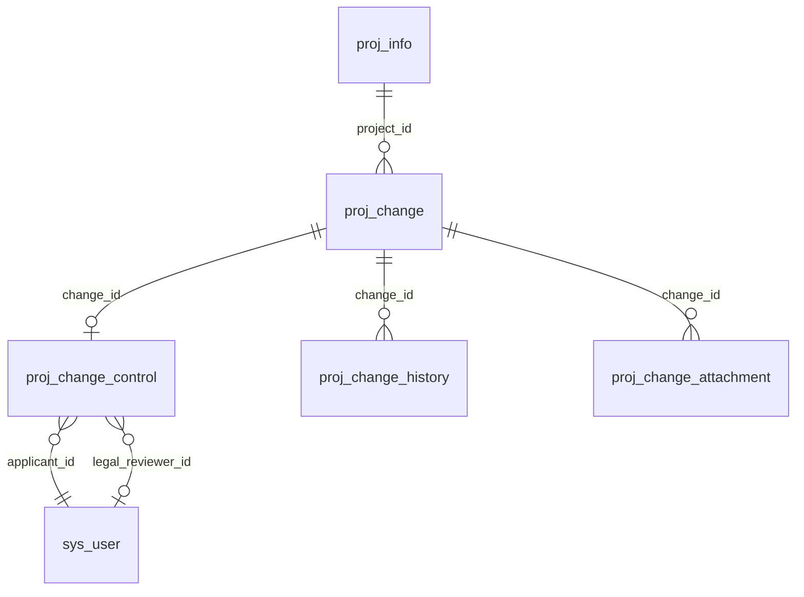
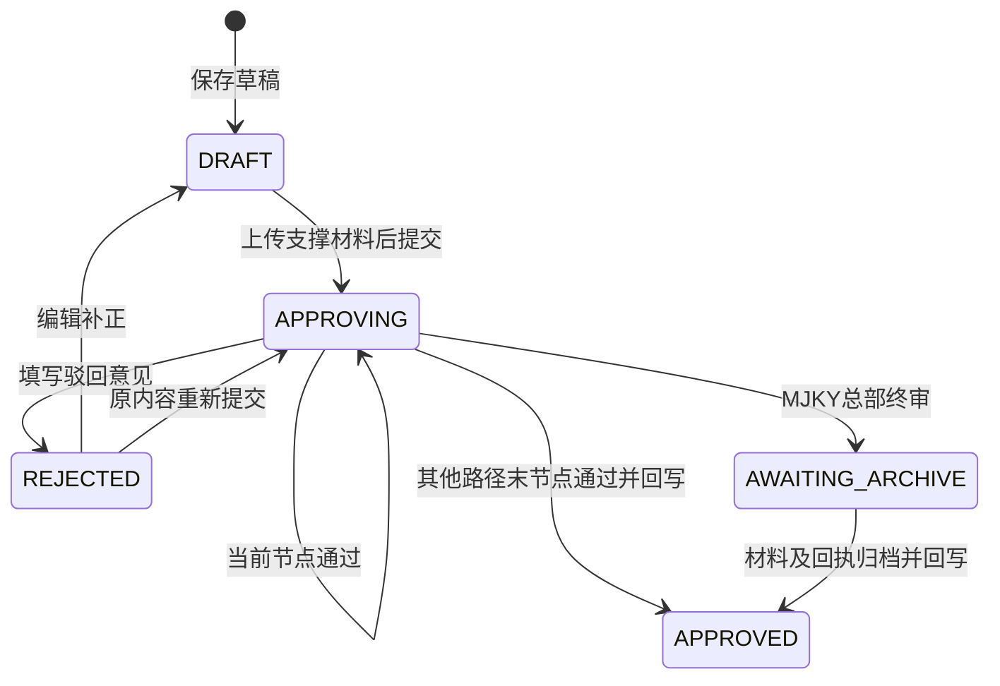

# 项目变更模块设计与维护指南

当前扩展以 [多项变更与多轮修订](08-多项变更与多轮修订.md) 为准：已支持一单多项、保存版本及 9 个演练场景。下文单字段说明为此前实现记录。

## 1. 文件与职责

| 文件 | 职责 |
| --- | --- |
| `frontend/src/views/implement/Change.vue` | 原路由页面；列表、筛选、详情/编辑抽屉、审核对话框、模块 scoped CSS |
| `frontend/src/views/implement/change/useChangeWorkbench.ts` | 页面状态、请求顺序、草稿脏状态、操作锁、上传下载、审核与归档交互 |
| `frontend/src/views/implement/change/policy.ts` | 状态/事项文案、流程预览、表单与文件基础校验 |
| `frontend/src/api/change.ts` | 本模块专用 API 适配；复用现有请求与会话处理；二进制下载单独处理 |
| `backend/.../change/controller/ChangeController.java` | HTTP 参数与统一返回包装，附件下载流 |
| `backend/.../change/service/ChangeService.java` | 授权、对象关联、状态流转、申请幂等、事务、履历、附件登记 |
| `backend/.../change/service/ChangeTargets.java` | 13 个可变字段白名单、对象范围校验、类型校验、最终回写 |
| `backend/.../change/service/ChangePolicy.java` | 按渠道生成流程、重大事项、可编辑状态和版本校验 |
| `backend/src/main/resources/db/migration_change_v2.sql` | 三张模块扩展表，幂等创建，无原表 ALTER/DROP |
| `backend/src/test/java/.../change/service/*Test.java` | 规则与字段边界测试 |
| `qa/change/` | 前端规则/状态单测、真实 API 测试、真实浏览器操作、隔离数据辅助工具 |

原 `api/modules.ts`、路由、布局、导航、全局 CSS、通用鉴权、其他业务页面和控制器没有在本次修改。原 `ProjChange` 实体、Mapper、主表字段保留。旧 API 的更新/提交/审核写入现在要求新版本号，调用者需要使用本模块的新契约；仓库中原页面已完成替换。

## 2. 数据结构



上图表达业务关联，迁移脚本未新增数据库外键。

- `proj_change`：兼容现有变更单号、标题、原因、前后值、状态和当前节点。
- `proj_change_control`：`target_key/target_id` 确定要变更的真实记录，`applicant_id` 避免只凭姓名判断，`legal_reviewer_id` 指定法务，`route_json` 固化流程代码，`step_index` 当前节点，`revision` 版本，`request_key` 创建幂等，`applied_at` 回写时间，`archive_ref` 线下回执。
- `proj_change_history`：追加 CREATE、EDIT、SUBMIT、APPROVE、REJECT、APPLY、ARCHIVE、UPLOAD、REMOVE_FILE、DELETE；记录操作者 ID、姓名/工号、节点、实际意见和时间。
- `proj_change_attachment`：SUPPORT 支撑材料 / EXTERNAL 归档材料，保存 MinIO 对象键、原文件名、大小、上传人和移除标记。界面只拿到文件 ID，不向页面暴露对象键。

材料保存在 `rpm-attachments` 桶的 `change/<申请ID>/...`。移除附件仅移除引用，删除草稿保留审计记录及附件元数据/对象，用于追溯；本次没有加入自动保留期限或批量清理策略。

## 3. 可变字段白名单

| targetKey | 类型 / 事项 | 表.字段 | 校验与说明 |
| --- | --- | --- | --- |
| milestoneDate | PROJECT / MILESTONE_DELAY | proj_milestone.plan_date | 本项目未完成节点；必须晚于旧日期、在项目周期内；同步节点红黄蓝及延期状态 |
| projectEnd | PROJECT / PERIOD | proj_info.end_date | 日期合法、不早于开始及已有里程碑/交付物/计划；需要法务 |
| totalFund | PROJECT / FUND | proj_info.total_fund | 万元、非负、最多两位小数、符合 DECIMAL(18,2)；不低于国拨+自筹或已发生支出；需要法务 |
| partnerName | PROJECT / OUTSOURCE | proj_participant.org_name | 128 字以内，拒绝黑名单合作单位；需要法务 |
| paymentDate | PROJECT / PAYMENT | proj_plan.due_date | TODO 且标题为付款/支付/拨付，未完成、未在办结审核中 |
| projectGoal | PROJECT / INDICATOR | proj_info.goal | 核心指标/目标，2000 字 |
| deliverableName | PROJECT / DELIVERABLE | proj_deliverable.name | 未交付，本项目，255 字 |
| deliverableDate | PROJECT / DELIVERABLE | proj_deliverable.due_date | 未交付，日期在周期内 |
| projectName | DATA / BASIC | proj_info.name | 名称纠错，255 字 |
| mainWork | DATA / BASIC | proj_info.main_work | 工作内容纠错，2000 字 |
| annualGoal | DATA / ANNUAL | proj_annual_plan.annual_goal | 本项目具体年度记录，2000 字 |
| annualContent | DATA / ANNUAL | proj_annual_plan.plan_content | 本项目具体年度记录，2000 字 |
| levelChannel | DATA / LEVEL | proj_info.channel_id | 渠道必须存在，同时更新 channel_name / level_code |

动态 SQL 的表和列只来自此白名单，客户端不能提供任意 SQL 标识符。保存时服务端重读真实旧值，不接受客户端伪造 `beforeValue`。每次最终回写前再次检查原值是否仍然一致。其他表里的历史冗余项目名称不批量重写，当前详情/列表关联主数据取现名称。

## 4. 状态与事务



关键约束：

- 变更写操作使用模块内 `READ_COMMITTED` 事务。先锁申请控制行，再锁项目及具体目标，读取当前版本；同一个节点同时审核，只能有一次成功。
- 创建先锁发起人行，通过 `(applicant_id, request_key)` 唯一键保证重复提交返回同一申请，不生成多个单号。
- 每次修改/上传/审核使 revision 递增。没有版本或版本过旧返回 409；页面保留错误并提示刷新，不静默覆盖。
- 未通过最后节点时不写目标。最后节点的原值校验、业务更新、状态、回写时间和 APPLY 履历在同一数据库事务中完成。
- 如果另一个申请已更新目标，本申请最终审核返回 409，状态停在原节点，办理人可驳回给发起人重新核对。
- MinIO 与 MySQL 不属于同一分布式事务；上传登记立即失败时执行对象清理。进程在上传与事务提交间崩溃仍可能遗留孤立对象，后续可按对象/引用核对清理。

## 5. 权限

| 场景 | 服务端规则 |
| --- | --- |
| 新建 | owner / contactLogin / projectPm / techLead 且属于该项目团队、项目处于实施中/延期 |
| 编辑、删除、维护支撑附件 | 本申请作者，草稿或驳回状态，仍有项目填报权限 |
| 提交 | 非技术负责人的申请作者；或由指定项目负责人提交技术负责人草稿 |
| 单位审核 | 优先项目指定 UNIT_MINISTER / UNIT_SUPERVISOR；没有指定人员时按身份和本单位匹配 |
| 总部终审 | 项目指定 HQ_DIRECTOR / HQ_SUPERVISOR；无指定时匹配相应总部身份 |
| 数据确认 | 总部科技主管 HQ_SUPERVISOR |
| 法务审核 | 配置法务工号名单中的指定在岗人员；不能发起人自审；有独立 LEGAL 节点 |
| GXB 归档 | 本申请发起人且总部审核已通过 |
| 查看 | 公司数据范围/管理员、同单位主管范围、项目关联人员；另允许申请作者与指定法务查看该申请 |
| 历史记录 | 所在项目可见时只读；禁止把没有控制信息的历史记录继续审核并回写 |

当前“待我办理”位于项目变更页面内。为遵守只改本模块，没有将新流程写入其他页面的统一待办/已办汇总，也没有修改全局工作定责文案。

## 6. API 契约

统一使用 `/api/changes`，普通业务返回 `{code,msg,data}`；业务错误可能仍为 HTTP 200，调用方必须检查 code。

| 方法 / 路径 | 输入 | 输出 / 效果 |
| --- | --- | --- |
| GET / | page、size、projectId、changeType、status、keyword、mine | records/total/page/size；每条含权限标记；size≤200（兼容原看板调用） |
| GET /context | 可选 projectId | 可见项目、可填报标记、目标、渠道、法务候选人 |
| GET /{id} | id | 详情、前后显示值、路径、附件、履历及当前权限 |
| POST / | projectId、changeType、category、targetKey、targetId、afterValue、title、reason、legalReviewerId、requestKey | 新建草稿详情 |
| PUT /{id} | 同上，另加 revision | 更新草稿详情；项目不能更换 |
| POST /{id}/submit | revision | 提交到第一个节点 |
| POST /{id}/audit | revision、pass、opinion | 通过当前节点或驳回；意见必填 |
| POST /{id}/archive | revision、reference、opinion | 检查归档材料、最终生效 |
| DELETE /{id} | query revision | 删除草稿并留审计 |
| POST /{id}/files | query revision、kind；multipart file | 真实上传并更新版本 |
| DELETE /{id}/files/{fileId} | query revision | 移除附件引用；提交后支撑材料锁定 |
| GET /{id}/files/{fileId}/download | 认证会话 | 授权验证后的二进制附件 |

## 7. 页面操作

1. 项目团队登录，进入“实施阶段 → 项目变更 → 发起变更”。选择本人的实施项目。
2. 选择“项目变更/数据变更”和具体目标。系统显示实际旧值；填写完整新值、标题与原因。重大变更可先保存草稿，提交前需选择配置名单内的法务办理人。
3. 保存草稿，上传非空支撑材料（PDF、Office、图片、TXT/MD；每份 ≤20 MB），再点击“提交审批”并确认。
4. 当前办理人进入本页“待我办理”，打开申请，填写意见后通过或驳回。驳回后发起人编辑补正并重提。
5. MJKY 总部通过后由发起人上传线下材料、填文号/回执号并完成归档。其他路径末节点完成即生效。
6. “查看”核对前后值、全部路径、附件、历史意见及生效时间。409 冲突时刷新查看最新状态，目标被改动时由审核人驳回后重新核对。

本地示例账号：项目负责人 `100012`、技术负责人 `100014`、单位部长 `100005`、单位科技主管 `100006`、总部科技主管 `100004`、总部部长 `100003`；本地演示密码与工号相同。隔离测试环境法务使用 `100009`，这只是测试授权，不是正式法务认定。原本地平台默认法务名单为空，配置与新界面见 [本轮指南](04-新界面与隔离演练指南.md)。

## 8. 部署与回退

本地访问：<http://127.0.0.1:6006/#/implement/change>。修改已包含在本地前端构建及后端 JAR 中。

新环境需要先按原部署指南启动 MySQL/Redis/MinIO，再执行 `backend/src/main/resources/db/migration_change_v2.sql`。脚本只创建模块扩展表，可重复执行；原有 `schema.sql` 含 DROP，**不要用它升级已有数据库**。

当前本地执行迁移的方法：

```bash
cd /home/dev/projects/ZGSFkeyan-yuyanplatform
python3 - <<'PY'
import runpy
from pathlib import Path
m = runpy.run_path('scripts/local-platform.py')
m['mysql'](Path('backend/src/main/resources/db/migration_change_v2.sql').read_text(), 'rpm')
PY
```

构建前端 `npm run build --prefix frontend`；构建后端时设置本地 JDK 17 并执行 Maven package；使用 `scripts/local-platform.py` 管理本地服务。无需新增 npm 或 Maven 项目依赖。

数据库迁移前快照为本地忽略目录 `deploy/change/before-change.sql`。回退可恢复上版前后端产物，新增三表可保留；不要直接删除已有变更审计。已经生效的真实业务变化不能靠回退代码撤销，须另走业务变更或在完整核对后使用数据库备份。

## 9. 已知技术边界

- 页面依赖真实后端和三张新表。旧 `VITE_USE_MOCK=true` 的假数据路由未扩展，不支持这一完整审批流程；本地部署使用真实服务。
- 查询先按条件取候选，再依据项目/人员可见范围过滤分页，避免固定 200 项目上限；当前实现存在多次项目/人员查询。没有做大规模性能或压测，数据量增大时宜下推授权 SQL、批量加载项目/人员。
- 流程的节点代码在保存时固化；节点办理人除法务外按项目现有指定团队解析。若审核期间项目定责改变，后续办理人随最新指定改变。
- 浏览器局部样式适配到 768px 抽屉；全局固定侧栏属于原页面结构，不宣称整个平台已具备手机端体验。
