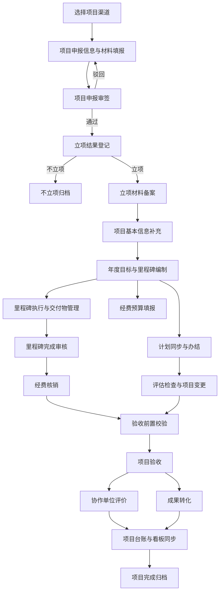

# 科研项目全生命周期流程节点责任人与填报上传信息说明

## 1 文档说明

本文依据《科研项目信息化管理平台需求 V19.1》，以流程节点为主线，说明每个节点的前置条件、责任人、填报内容、上传材料、审批权限、完成结果和后续流向。

本文用于：

- 配置项目申报、实施、验收和成果转化流程；
- 将申报阶段填写的人员准确绑定到后续填报和审批节点；
- 校验待办消息、红点数量、审批入口和“我的已办”；
- 编写全生命周期流程测试用例；
- 核对项目台账、材料归档和审计日志是否同步更新。

不同项目渠道的材料和审批节点存在差异时，以经审批发布的渠道流程模板为准。

## 2 全生命周期流程主线

## 3 节点责任绑定通用规则

1. 项目申报阶段填写的岗位人员是后续流程人员绑定的权威来源。
2. 每个岗位保存姓名、工号、组织和岗位编码，人员匹配以工号为主、姓名为辅助。
3. 人工节点必须绑定到具体人员或明确的组织型评审组，不使用只有角色名称的空节点。
4. 当前节点只向指定人员生成待办；同岗位的其他人员不能代办。
5. 当前人员完成审批后，任务进入其“我的已办”，同时向下一节点人员生成新待办。
6. 驳回后退回规定的填报节点，保留原材料、审批意见、附件版本和完整轨迹。
7. 人员发生变动时，通过岗位变更或正式转办移交未完成任务，禁止直接替换历史审批人。
8. 已审批生效的信息原则上锁定；需要调整时走项目变更或数据变更流程。

## 4 立项阶段流程节点

### 4.1 节点一 选择项目渠道

| 项目 | 说明 |
|---|---|
| 责任人 | 项目联系人、项目负责人或获得申报填报权限的项目团队人员 |
| 前置条件 | 登录人员具备申报权限，人员账号有效 |
| 填报内容 | 项目层级、立项部门、项目渠道、一级专业、二级专业、管理或需求单位、责任单位 |
| 上传材料 | 本节点不要求上传；选择渠道后系统生成相应材料栏位 |
| 系统校验 | 渠道编码有效且唯一；项目层级与渠道匹配；非本渠道材料字段锁定 |
| 完成结果 | 加载渠道对应的申报材料、立项材料和审批流程模板 |
| 下一节点 | 项目申报信息与材料填报 |

### 4.2 节点二 项目申报信息与材料填报

| 项目 | 说明 |
|---|---|
| 责任人 | 项目联系人牵头，项目负责人、技术负责人、项目主管可按授权协同填报 |
| 前置条件 | 已选定项目渠道并加载对应表单 |
| 填报内容 | 项目名称、项目目标、年度目标、项目起止时间、申报经费、牵头单位、主要工作内容、参研单位、专业分类及其他渠道要求字段 |
| 人员信息 | 项目联系人、项目负责人、技术负责人、项目主管、一级总师、二级总师、项目承担部门负责人、总部处室处长、总部处室主管、单位科技部长、单位科技主管、总部财务主管、单位财务部长、单位财务主管、单位分管领导 |
| 上传材料 | 按项目渠道上传申报书、建议书、任务清单、评审意见或其他申报佐证材料 |
| 可执行操作 | 暂存、编辑、替换未提交附件、校验并提交、撤销草稿 |
| 系统校验 | 必填字段、日期范围、经费、人员工号、岗位完整性、渠道材料完整性和项目名称重复性 |
| 完成结果 | 生成申报单号、岗位人员快照和审批流程实例 |
| 下一节点 | 项目负责人审核；项目负责人本人提交时也进入项目负责人审核节点 |

### 4.3 各渠道申报和立项材料

| 项目级别 | 项目渠道 | 项目申报上传材料 | 项目立项上传材料 |
|---|---|---|---|
| 国家级 | MJKY | 建议书、建议书意见 | 立项批复 |
| 国家级 | 04 专项接续 | 建议书、建议书意见 | 立项批复 |
| 国家级 | 重点研发计划 | 申请书、申请书评审 | 无固定立项材料或按渠道补充 |
| 国家级 | XX25 专项 | 申报通知、任务清单、任务清单评估 | 无固定立项材料或按渠道补充 |
| 国家级 | 国家自然科学基金 | 申请书、申请书评审 | 批准通知 |
| 地方级 | 揭榜挂帅 | 榜单答疑 | 申请书评审 |
| 地方级 | 科技创新行动计划 | 建议书、建议书评审 | 立项通知 |
| 公司级 | 预研三年滚动计划 | 建议书、建议书评审 | 立项通知 |
| 公司级 | 新疆大飞机气象创新中心 | 申请书、申请书评审、技术委员会或主任委员会或理事会审议材料 | 立项通知 |
| 公司级 | 科技周 | 合作需求、需求对接总结、技术发展战略委员会审议材料 | 拟立项通知、立项文件 |
| 公司级 | 大飞机研究院 | 项目申请书、学术委员会审议材料 | 立项通知 |
| 公司级 | 大飞机先进材料创新联盟 | 项目申请书 | 立项建议清单、联盟专委会审议意见、联盟理事会审议意见 |
| 公司级 | 中国商飞 波音可持续航空技术研究中心项目 | 波音指导委员会会议纪要 | 三方合同 |

### 4.4 节点三至节点十一 常规项目申报审签

以下链路适用于 MJKY、04 专项接续、重点研发计划、国家自然科学基金、揭榜挂帅、科技创新行动计划、预研三年滚动计划和新疆大飞机气象创新中心。XX25 专项不包含单位财务部门负责人节点。

| 顺序 | 流程节点 | 责任人来源 | 查看和审核内容 | 可执行操作 | 完成结果 |
|---:|---|---|---|---|---|
| 1 | 项目负责人审核 | 申报岗位中的项目负责人 | 全部申报字段、渠道材料、项目团队人员 | 通过、驳回、填写意见、按权限替换附件 | 通过后进入承担部门负责人；驳回后退回申报填报 |
| 2 | 项目承担部门负责人审核 | 申报岗位中的项目承担部门负责人 | 项目必要性、部门承担能力、人员和材料完整性 | 通过、驳回、填写意见 | 通过后进入二级总师 |
| 3 | 二级总师审核 | 申报岗位中的二级总师 | 技术方案、专业归属、目标和技术材料 | 通过、驳回、填写技术意见 | 通过后进入单位财务部门负责人；XX25 直接进入单位科技部门负责人 |
| 4 | 单位财务部门负责人审核 | 申报岗位中的单位财务部长 | 申报经费、预算依据和财务相关材料 | 通过、驳回、填写财务意见 | 通过后进入单位科技部门负责人 |
| 5 | 单位科技部门负责人审核 | 申报岗位中的单位科技部长 | 申报合规性、渠道要求、单位管理意见 | 通过、驳回、填写管理意见 | 通过后进入单位分管领导 |
| 6 | 单位分管领导审核 | 申报阶段单独配置的单位分管领导 | 项目必要性、资源投入和单位意见 | 通过、驳回、填写复核意见 | 通过后进入一级总师 |
| 7 | 一级总师审核 | 申报岗位中的一级总师 | 公司级技术方向、专业技术意见和重大风险 | 通过、驳回、填写技术意见 | 通过后进入总部科技部科研项目处 |
| 8 | 总部科技部科研项目处审核 | 渠道归口的总部处室处长或主管 | 全部申报资料和前序审批意见 | 通过、驳回、填写总部意见 | 通过后进入线下报批或立项结果登记 |
| 9 | 线下报批材料归档 | 总部科技部经办人员 | 线下报批文件、批复和过程材料 | 上传、登记、归档 | 形成可追溯的线下审批记录 |

每个节点的待办必须传递给申报阶段指定的具体工号。审批人只能修改本节点审批意见及允许替换的附件，不能直接改写项目团队提交的业务字段。

### 4.5 特殊渠道审签节点

| 项目渠道 | 节点主线 | 责任人和材料要求 |
|---|---|---|
| 科技周 | 项目负责人 → 三级专业总师 → 二级专业总师 → 单位科技部 → 单位科技部门负责人 → 单位分管科技领导 → 总部科技部科技发展处 → 一级总师 → 总部科技管理部 → 需求发布 → 技术发展战略委员会审查 → 拟立项清单发布 | 专业总师、科技发展处、委员会和发布节点分别配置具体人员或评审组；上传合作需求、需求对接总结和委员会审议材料 |
| 大飞机研究院 | 建设单位征集指南 → 学术委员会评审 → 指南发布 → 项目建议书形成 → 学术委员会评审 → 拟立项清单 → 理事会审议 → 研究院立项 | 建设单位、学术委员会、理事会分别负责对应材料和意见；上传项目申请书、学术委员会审议材料和立项通知 |
| 大飞机先进材料创新联盟 | 联盟成员单位提交申请书 → 联盟专委会审查 → 联盟理事会审查 → 公司科技部报批 | 上传项目申请书、专委会意见或纪要、理事会意见或纪要和立项建议清单 |
| 中国商飞 波音可持续航空技术研究中心项目 | 项目负责人 → 北研中心科技部主管 → 北研中心科技部部长 → 北研中心分管领导 → 总部科技部主管 | 上传波音指导委员会会议纪要；立项阶段上传三方合同 |

### 4.6 节点十二 立项结果登记

| 项目 | 说明 |
|---|---|
| 责任人 | 超级管理员或正式授权的立项结果办理人 |
| 前置条件 | 线上审批完成，需线下报批的项目已上传有效批复材料 |
| 填报内容 | 立项或不立项结果、结果日期、结果说明 |
| 上传材料 | 正式批复、立项通知或不立项依据 |
| 可执行操作 | 登记结果、归档材料，不修改原申报内容 |
| 完成结果 | 不立项项目归档；立项项目进入立项材料备案 |
| 下一节点 | 项目立项备案 |

### 4.7 节点十三 项目立项备案

| 项目 | 说明 |
|---|---|
| 责任人 | 项目团队，通常由项目负责人负责提交 |
| 前置条件 | 申报审批通过且立项结果为立项 |
| 填报内容 | 备案日期、备案部门、立项编号及渠道要求信息 |
| 上传材料 | 任务书、立项批复、批准通知、立项通知、签署文件、合同或渠道专属材料 |
| 审核或确认人 | 总部归口管理人员或流程模板指定人员 |
| 完成结果 | 生成正式项目，进入实施阶段 |
| 人员同步 | 将申报岗位姓名、工号和岗位编码同步到项目团队，作为后续流程责任人来源 |

## 5 实施阶段流程节点

### 5.1 节点十四 项目基本信息补充

| 项目 | 说明 |
|---|---|
| 填报人 | 项目团队 |
| 前置条件 | 项目立项备案完成，系统已回显立项数据 |
| 填报内容 | 项目编号、目标、开始时间、结束时间、层级、立项部门、渠道、牵头单位及工作内容、参研单位及工作内容、项目负责人、技术负责人、项目主管、一级总师、二级总师、年度目标和总经费等缺失字段 |
| 上传材料 | 支撑基本信息的任务书、立项文件或补充说明材料 |
| 审批链 | 项目团队填报 → 项目负责人审核 → 单位科技管理部审核 → 单位分管领导复核 → 总部科研项目处确认 |
| 完成结果 | 审批通过后更新项目台账；未通过前不覆盖正式台账数据 |

### 5.2 节点十五 年度目标与里程碑清单编制

| 项目 | 说明 |
|---|---|
| 填报人 | 项目团队，技术负责人牵头 |
| 办理时间 | 每个自然年度年初，原则上四月前 |
| 前置条件 | 项目处于实施中且基本信息有效 |
| 填报内容 | 年度目标、里程碑名称、计划完成日期、节点预算、对应交付物 |
| 上传材料 | 线下编制的年度目标和里程碑清单、年度预算或中期调整预算 |
| 审批链 | 项目团队提交 → 二级单位科技部门审核存档 |
| 完成结果 | 形成年度里程碑基线，启动四色预警并允许绑定预算和交付物 |

### 5.3 节点十六 里程碑预警与执行

| 项目 | 说明 |
|---|---|
| 责任人 | 项目团队负责推进；管理团队负责督办 |
| 填报内容 | 当前进度、完成情况、滞后原因和预计处理措施 |
| 上传材料 | 过程报告、试验记录、阶段成果或其他执行佐证 |
| 系统动作 | 距到期超过 30 天显示蓝色；到期前 30 天内显示黄色；到期未完成显示红色；完成审核后显示绿色 |
| 通知对象 | 项目团队和对应管理团队 |
| 变更限制 | 需要延后计划日期时禁止直接修改，必须进入项目变更流程 |

### 5.4 节点十七 里程碑完成与材料审核

| 项目 | 说明 |
|---|---|
| 填报人 | 项目团队，通常由技术负责人或项目负责人上传 |
| 前置条件 | 已完成节点工作；对应交付物状态和材料满足要求 |
| 填报内容 | 实际完成日期、完成说明、滞后原因和完成结论 |
| 上传材料 | 试验报告、评审结论、验收证明、交付物证明及节点要求的其他佐证 |
| 审核人 | 二级单位内部核验人员或渠道流程指定人员 |
| 完成结果 | 审核通过后节点闭环销项并转为绿色；驳回后由项目团队补充材料 |
| 下一节点 | 节点经费核销；全部节点完成后进入验收前置校验 |

### 5.5 节点十八 计划同步与办结

| 项目 | 说明 |
|---|---|
| 数据来源 | CMOS 系统自动导入已发布的预研项目计划、专项计划及完成情况 |
| 填报人 | 原则上无需重复填报；项目团队补充办结说明或材料 |
| 上传材料 | 计划完成证明或渠道要求的办结佐证 |
| 审批链 | 项目团队提交办结申请 → 二级单位管理团队终审 |
| 完成结果 | 审批通过后由待办计划转入已完成计划，保留历史记录 |
| 系统状态 | 绿色为完成，蓝色为正常，黄色为 30 天内到期，红色为超期 |

### 5.6 节点十九 经费预算填报

| 项目 | 说明 |
|---|---|
| 填报人 | 项目团队 |
| 前置条件 | 年度里程碑清单已经审核生效 |
| 填报内容 | 年度、里程碑、预算科目、预算金额、资金来源和说明 |
| 上传材料 | 年度预算、预算依据及需要的预算凭证 |
| 审批链 | 项目团队提报 → 二级单位财务部门审核 → 总部财务团队复核备案 |
| 完成结果 | 预算生效，写入项目经费台账并绑定对应里程碑 |

### 5.7 节点二十 经费核销

| 项目 | 说明 |
|---|---|
| 填报人 | 二级单位财务经办或单位财务主管 |
| 前置条件 | 对应里程碑已经完成全部审核并闭环 |
| 填报内容 | 核销年度、里程碑、支出金额、支出日期、支出用途、凭证信息和核销说明 |
| 上传材料 | 付款凭证、发票、结算单、支出明细及其他核销佐证 |
| 审核或确认人 | 二级单位财务部长或流程配置的单位财务负责人 |
| 完成结果 | 完成本级核销，更新项目累计支出和剩余预算 |
| 系统同步 | 将单位经费执行和结余数据同步至总部经费数据及看板；异常数据由两级财务联合核查 |

### 5.8 节点二十一 评估检查

| 项目 | 填报人 | 上传材料 | 审批链 | 完成结果 |
|---|---|---|---|---|
| MJKY、04 专项接续、重点研发计划、国家自然科学基金 | 项目团队 | 中期评估相关材料；国家自然科学基金还包括年度实施报告 | 二级单位主管部门初审 → 总部对应管理部门终审 | 归档评估结论；不合格进入整改 |
| XX25 专项 | 项目团队 | 季度会、季度报、年度评估、国资委现场督导材料 | 二级单位主管部门初审 → 总部对应管理部门终审 | 归档检查结论 |
| 揭榜挂帅 | 项目团队 | 中期评审材料 | 二级单位主管部门初审 → 总部对应管理部门终审 | 归档评审结论 |
| 科技创新行动计划 | 项目团队 | 阶段性检查材料 | 二级单位主管部门初审 → 总部对应管理部门终审 | 归档检查结论 |
| 预研三年滚动计划、新疆大飞机气象创新中心 | 项目团队 | 阶段性检查材料 | 二级单位主管部门初审 → 总部对应管理部门终审 | 归档检查结论 |
| 大飞机研究院 | 项目团队或研究院管理人员 | 重大项目中期检查材料 | 学术委员会中期评审 | 形成评审意见 |
| 大飞机先进材料创新联盟、中国商飞 波音项目 | 项目组 | 阶段性检查材料 | 二级单位主管部门初审 → 二级单位审查确认 | 归档检查结论 |

### 5.9 节点二十二 项目变更和数据变更

| 项目 | 项目变更 | 数据变更 |
|---|---|---|
| 填报人 | 项目团队 | 项目团队 |
| 适用内容 | 延期、总经费调整、外协单位更换、付款节点、考核指标、项目周期、交付物等重大调整 | 年度任务填报失误等小范围数据纠错 |
| 填报内容 | 变更类型、变更前内容、变更后内容、变更原因和影响分析 | 原数据、新数据、纠错原因和影响说明 |
| 上传材料 | 变更申请、论证材料、批复或合同等佐证 | 数据来源、证明材料或审批依据 |
| 审批链 | 二级单位主管部门初审 → 总部对应部门终审；重大变更增加法务审核 | 二级单位内部审批 → 总部科技主管确认 |
| 完成结果 | 通过后系统更新受控字段并保留变更前后值 | 通过后更新对应字段并保留纠错记录 |

## 6 验收阶段流程节点

### 6.1 节点二十三 验收前置校验

| 校验项 | 通过条件 | 不通过处理 |
|---|---|---|
| 里程碑 | 全部里程碑闭环且审核通过 | 返回未完成节点，禁止提交验收 |
| 交付物 | 全部核心交付物为已交付 | 返回交付物清单补充 |
| 外协事项 | 外协交付物验收合格 | 返回外协或合同处理 |
| 经费 | 节点预算匹配且核销完成，无在途核销 | 返回财务核销节点 |
| 评估整改 | 不合格评估的整改已经闭环 | 返回整改节点 |
| 验收材料 | 当前渠道要求的材料完整 | 返回验收材料填报 |

### 6.2 节点二十四 项目验收申请

| 项目 | 说明 |
|---|---|
| 填报和提交人 | 项目团队，通常由项目负责人发起 |
| 填报内容 | 验收类型、验收层级、申请日期、完成情况、目标达成情况和验收说明 |
| 上传材料 | 按项目层级上传单位级、公司级、国家级或属地主管部门验收材料，以及评审结论和佐证 |
| 表单规则 | 国家级开放单位、公司、国家三级；地方级开放单位和属地主管部门两级；公司级开放单位和公司两级；无关层级锁定 |
| 审批链 | 项目团队 → 二级单位管理团队初审 → 国家级或 MJKY 重大项目增加责任总师技术复核 → 总部管理团队终审 |
| 完成结果 | 验收通过后归档验收材料并启动协作单位评价倒计时；驳回后补正 |

### 6.3 节点二十五 交付物确认

| 项目 | 说明 |
|---|---|
| 填报人 | 项目团队 |
| 填报内容 | 交付物名称、类型、状态、权属和关联成果编号 |
| 上传材料 | 专利、论文、软件著作权、技术标准、原理样机、设备、成套技术成果等原件或证明材料 |
| 审批链 | 项目团队 → 二级单位管理团队 → 总部管理团队 |
| 完成结果 | 已交付数据同步项目台账和看板，可供成果转化模块选择 |
| 限制 | 应与任务书考核指标一一对应；未交付成果不能进入成果转化包 |

### 6.4 节点二十六 协作单位评价

| 项目 | 说明 |
|---|---|
| 填报人 | 项目团队填报协作单位基础信息并参与评分 |
| 启动条件 | 参研单位在项目验收完成后启动；外协单位在外协合同验收完成后启动 |
| 办理时限 | 启动后 30 日内完成 |
| 填报内容 | 协作单位名称、协作类型、评价人员、技术能力、交付质量、进度履约、服务配合、合规性、总分和评价等级 |
| 上传材料 | 评价报告、评分依据、问题佐证和其他评价材料 |
| 审批链 | 项目团队 → 二级单位管理团队 → 总部管理团队 |
| 完成结果 | 形成优秀、良好、合格或不合格评价；不合格单位按程序协调法律部门处理并提供明确佐证 |

## 7 成果转化节点

### 7.1 节点二十七 成果转化信息填报

| 项目 | 说明 |
|---|---|
| 填报人 | 项目团队 |
| 前置条件 | 至少存在一项已交付成果 |
| 填报内容 | 成果名称、所属项目、成果简介、转化方式、转化形式、计划转化时间、实际转化时间、转化状态、转化简介、责任单位和关联交付物 |
| 上传材料 | 转化方案、协议、应用证明、市场转化材料、合同或其他成效佐证 |
| 审批链 | 项目团队填报或更新 → 二级单位管理团队审核确认 → 总部管理团队备案 |
| 完成结果 | 生成全局唯一成果编号，数据同步项目台账、交付物记录和可视化看板 |
| 预警规则 | 按计划转化时间产生蓝、黄、红、绿状态并向责任部门和管理团队推送预警 |

### 7.2 节点二十八 项目完成归档

| 项目 | 说明 |
|---|---|
| 责任人 | 项目团队整理，二级单位和总部管理团队按流程确认 |
| 前置条件 | 验收完成；关键交付物归档；经费核销完成；规定的评价和成果转化信息完整 |
| 上传材料 | 项目全过程归档清单、最终验收材料、成果材料、经费凭证及需长期保存的其他资料 |
| 完成结果 | 项目状态转为已完成或已归档，业务数据原则上只读 |
| 系统同步 | 全流程数据汇总至项目台账和可视化看板，材料统一线上归档 |

## 8 申报岗位与后续节点对应关系

| 申报阶段岗位 | 后续填报节点 | 后续审批节点 | 查看范围 |
|---|---|---|---|
| 项目联系人 | 申报材料、部分过程材料和补正材料 | 原则上不承担专业审批 | 本人关联项目 |
| 项目负责人 | 项目基本信息、验收申请、项目总体事项 | 项目负责人审核及配置给负责人的节点 | 本人负责项目 |
| 技术负责人 | 年度目标、里程碑、交付物和技术佐证 | 配置给技术负责人的技术确认节点 | 本人关联项目 |
| 项目主管 | 计划、评估、变更和过程信息 | 配置给项目主管的办结或初核节点 | 本人关联项目 |
| 项目承担部门负责人 | 原则上不直接修改项目填报数据 | 项目申报承担部门审核 | 本部门经手项目 |
| 二级总师 | 技术意见 | 申报、评估和验收中的单位级技术审核 | 本人经手项目 |
| 一级总师 | 技术意见 | 申报及重大项目验收的公司级技术审核 | 本人经手项目 |
| 单位科技主管 | 计划、检查、管理材料和备案协同 | 配置给单位主管的初核节点 | 本单位项目 |
| 单位科技部长 | 单位管理意见 | 单位科技部门负责人、单位管理团队审核 | 本单位项目 |
| 单位分管领导 | 复核意见 | 单位分管领导审核 | 本单位经手项目 |
| 单位财务主管 | 付款凭证、核销材料和数据核对 | 配置给财务主管的经办或初核节点 | 本单位项目经费 |
| 单位财务部长 | 财务审核意见 | 单位财务部门负责人、预算和核销审核 | 本单位项目经费 |
| 总部财务主管 | 总部经费复核和异常核查信息 | 总部财务复核备案、拨付审核 | 总部职责范围经费 |
| 总部处室主管 | 总部管理材料、备案和督办信息 | 配置给总部主管的审核节点 | 责任范围项目 |
| 总部处室处长 | 总部管理意见 | 总部责任部门终审节点 | 全公司或责任范围项目 |

## 9 待办消息和审批记录规则

| 事件 | 待办处理 | 已办和审计处理 |
|---|---|---|
| 流程提交 | 为第一个审核节点指定人员生成待办和红点 | 记录提交人、工号、时间、材料版本和流程编号 |
| 节点通过 | 当前办理人待办消失，为下一节点指定人员生成待办 | 当前节点进入“我的已办”，记录意见、结果和时间 |
| 最终通过 | 不再生成普通审批待办，进入备案、结果登记或业务完成节点 | 全部节点形成完整审批轨迹 |
| 节点驳回 | 当前待办关闭，向规定的补正人员生成待办 | 保存驳回人、意见、退回节点和原材料版本 |
| 流程撤销 | 关闭所有未办任务，业务恢复草稿或允许编辑状态 | 记录撤销人、原因和时间 |
| 人员转办 | 原办理人待办关闭，新办理人获得待办 | 记录原人员、新人员、转办原因和操作者 |
| 附件替换 | 当前经办人或审核人按权限替换 | 保存附件名称、版本、上传人和时间，不覆盖历史版本 |

## 10 节点接口和页面权限要求

1. 列表权限、详情权限、附件权限和审批接口必须使用相同的数据范围规则。
2. “待我审核”按当前节点和具体工号查询，不应仅按组织或角色过滤。
3. “我的已办”按实际办理人工号查询，审批完成后仍可查看本人办理过的项目、材料和意见。
4. 当前节点不是本人时，页面不显示可操作审批按钮；即使绕过页面直接调用接口，也必须返回无权限。
5. 项目团队填报内容与审批意见分区保存，审核人不得直接覆盖原始填报内容。
6. 后续流程始终读取立项时同步的项目岗位人员；不得使用固定姓名或只按身份随机选择人员。
7. 岗位人员缺失、停用或无法匹配时禁止流程提交，并明确提示缺失岗位。
8. 组织型评审节点需记录参与成员、会签方式、最低通过条件、评审意见和会议材料。
9. 所有关键节点完成后同步项目台账；需审批的数据只有审批通过后才更新正式台账。

## 11 需求配置缺口

根据 V19.1 文档，以下节点在系统实施前需要进一步明确或补充配置：

1. 标准申报链包含“单位分管领导”，但项目团队字段表未列出该岗位，应增加姓名和工号字段或在渠道流程模板中指定人员来源。
2. 项目联系人存在于申报流程，但项目台账团队字段未列出，应保留其流程身份，并明确是否进入项目团队台账。
3. 科技周流程中的三级专业总师、二级专业总师、技术发展战略委员会和需求发布节点需要独立角色和人员组。
4. 大飞机研究院流程中的学术委员会、理事会，以及先进材料创新联盟的专委会、理事会需要配置会签规则。
5. 项目申报查看范围提到评审团队，但角色定义未明确其成员、有效期和可见字段，应增加评审任务授权规则。
6. 经费数据优先从各单位系统抓取；无法抓取时，应明确由项目团队或二级单位财务人工填报的切换条件。
7. 特殊渠道未明确的材料、办理人和终审节点不得通过固定人员兜底，应由渠道模板维护。

## 12 全流程验收检查清单

- [ ] 选择渠道后只开放本渠道所需材料字段。
- [ ] 申报岗位均保存姓名和工号，单位分管领导等审批岗位不缺失。
- [ ] 项目团队成员提交后，项目负责人正确收到审核任务。
- [ ] 项目负责人本人提交后，仍能进入并完成项目负责人审核节点。
- [ ] 二级总师、财务、单位管理、一级总师和总部节点均传递给申报时指定人员。
- [ ] XX25 专项正确跳过单位财务部门负责人节点。
- [ ] 特殊渠道按照独立流程模板流转并保存评审组意见。
- [ ] 驳回、撤销、转办和附件替换均有完整历史记录。
- [ ] 立项备案后申报人员完整同步到项目团队。
- [ ] 项目基本信息、里程碑、计划、经费和评估节点使用同步后的岗位人员。
- [ ] 里程碑未完成或未审核时不能进行对应经费核销。
- [ ] 全部里程碑完成审核后，二级单位财务可以上传核销材料并完成核销。
- [ ] 验收提交前正确校验里程碑、交付物、经费和整改状态。
- [ ] 验收完成后按规定启动协作单位评价和成果转化。
- [ ] 待办红点、待办列表、审批详情和“我的已办”数量一致。
- [ ] 非当前节点人员无法通过页面或接口越权审批。
- [ ] 各节点审批通过后正确同步项目台账、经费数据和可视化看板。

## 13 依据说明

本文以《科研项目信息化管理平台需求 V19.1》中平台角色定义、导航权限、项目申报材料清单、申报审签流程、实施阶段审批流、验收流程和成果转化流程为依据。本文将分散在需求文档中的职责、材料和审批关系统一整理为节点化说明，不改变原需求规定的业务方向。
