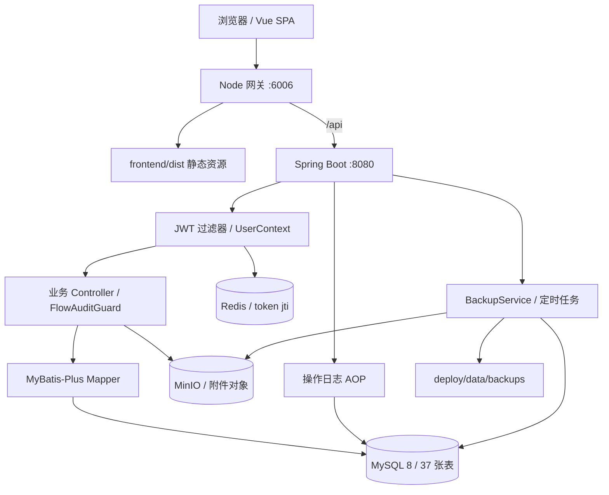
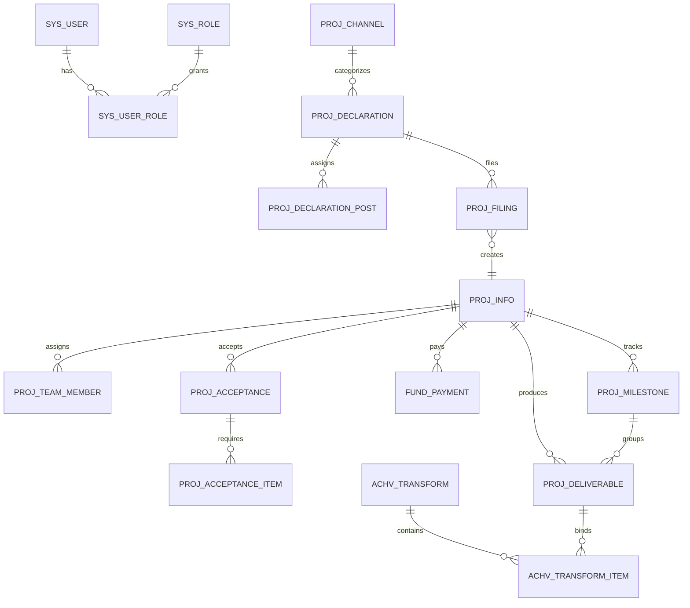
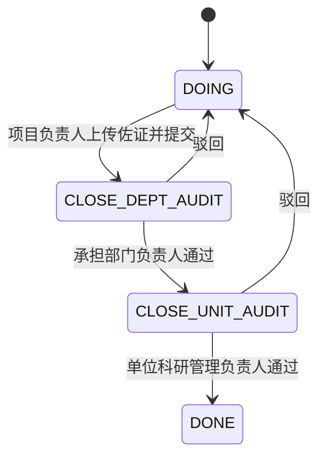

# 平台架构与本地部署

本文依据实际源码、当前构建和本地运行结果编写。仓库基线为 `132a8281f1cf4bdb99d71c1870e886efebc87135`，本次部署时间为 2026-09-13（America/Los_Angeles；北京时间为 2026-09-14）。原 README、历史说明和业务需求存在版本差异，下文区分实际实现与尚未完成的能力。

## 1. 本地入口与日常操作

仓库位于 `/home/dev/projects/ZGSFkeyan-yuyanplatform`。原工作目录 `/home/dev/research_platform` 属于 root，当前 dev 用户不能写入，因此选择用户自己的 projects 目录完成部署。

| 服务 | 地址 | 说明 |
| --- | --- | --- |
| 平台 | http://127.0.0.1:6006 | Vue 正式构建 + Node 静态服务和 API 反向代理，Mock 已关闭 |
| 后端健康 | http://127.0.0.1:8080/api/health | 进程健康响应；不主动检测 MySQL/Redis/MinIO |
| 接口文档 | http://127.0.0.1:8080/swagger-ui/index.html | OpenAPI：`/v3/api-docs` |
| MySQL | 127.0.0.1:3306 | 本地独立实例，业务库 rpm |
| Redis | 127.0.0.1:6379 | JWT 会话，AOF 持久化 |
| MinIO API / 控制台 | 127.0.0.1:9000 / 9001 | bucket：rpm-attachments |

“本地”指当前执行环境所在机器。若浏览器在另一台电脑，需要通过该环境的端口转发功能访问 6006；全部服务只监听环回地址。

```bash
cd /home/dev/projects/ZGSFkeyan-yuyanplatform
python3 scripts/local-platform.py status
python3 scripts/local-platform.py stop
python3 scripts/local-platform.py start
python3 scripts/local-platform.py restart
```

服务以独立后台进程运行，日志在 `deploy/logs`，PID 与进程启动时间在 `deploy/run`。脚本检查端口占用并验证 PID 身份；重启保留数据，不重新导入 SQL。没有配置操作系统开机自启，机器重启后执行 `start`。

登录页有 16 人快捷入口，当前账号与密码均为工号：

| 账号 / 密码 | 任职身份 |
| --- | --- |
| 100001 / 100001 | 系统管理员 |
| 100002 / 100002 | 公司领导 |
| 100003 / 100003 | 总部责任处室处长 |
| 100004 / 100004 | 总部科研项目主管 |
| 100005 / 100005 | 单位科研管理部门负责人 |
| 100006 / 100006 | 单位项目主管 |
| 100007 / 100007 | 一级总师 |
| 100008 / 100008 | 二级总师 |
| 100009 / 100009 | 总部财务主管 |
| 100010 / 100010 | 单位财务部长 |
| 100011 / 100011 | 单位财务主管 |
| 100012 / 100012 | 项目负责人 |
| 100013 / 100013 | 项目联系人 |
| 100014 / 100014 | 技术负责人 |
| 100015 / 100015 | 项目主管 |
| 100016 / 100016 | 项目承担部门负责人 |

数据库保留初始化产生的四个历史用户行，但本地已停用 `pm01/chief01/mgr01/fin01`。管理员账号已迁移为 100001。数据库、JWT 和 MinIO 的随机密钥保存在权限为 0600 的 `deploy/local-secrets.json`；这些本地文件受仓库 `.gitignore` 排除。

## 2. 总体架构

平台是一个前后端分离的业务单体：Vue 负责页面、表单、图表和办理入口，Spring Boot 负责 REST API、身份认证、业务校验、数据库访问和对象存储。没有独立的工作流引擎、消息队列或搜索集群。



当前规模：121 个 Java 源文件，30 个 Vue 页面文件，13 个 Vue 公共组件，运行时 OpenAPI 提供 110 条路径、141 个操作。完整接口与表清单见 [本地架构清单](./本地架构清单.md)。

| 层次 | 实际技术版本 / 实现 |
| --- | --- |
| 前端 | Vue 3、Vue Router 4、Pinia 2、TypeScript 5、Vite 5 |
| UI / 图表 / 导入导出 | Ant Design Vue 4、ECharts 5、xlsx、ExcelJS |
| HTTP | Axios，统一返回体 `{code,msg,data}`；分页 `{records,total,page,size}` |
| 后端 | Java 17、Spring Boot 3.2.5、Spring Security、Validation、AOP |
| ORM | MyBatis-Plus **3.5.7**，MySQL Connector/J |
| 认证 | BCrypt 密码 + 自实现 HS256 JWT + Redis jti 会话 |
| 文件 | MinIO Java SDK 8.5.12 |
| 本机工具 | Node 24.19.0、Temurin JDK 17.0.20.1、Maven 3.9.9 |
| 本机基础服务 | MySQL 8.0.46、Redis 7.0.15、MinIO RELEASE.2025-04-22T22-12-26Z |

## 3. 业务模块与源码分工

后端实际以 `entity / mapper / controller` 为主，大部分业务直接写在 Controller 内；只有看板聚合、权限矩阵、备份、文件等部分抽成 Service。因此理解某一业务规则时，必须同时阅读页面、工具函数和控制器，不能假设所有规则都集中在 Service。

| 业务域 | 前端位置（frontend/src/） | 后端模块（com/comac/rpm/modules/） | 核心数据 |
| --- | --- | --- | --- |
| 工作台与待办 | views/dashboard/Workbench.vue、stores/pending.ts | dashboard、各业务 pending/board 接口 | 从申报、维护、里程碑、经费聚合 |
| 一本账与全生命周期 | views/overview/Ledger.vue、ProjectDetail.vue | project/ProjectController | proj_info、团队、参研单位、年度计划 |
| 经营看板 / 预研大屏 | views/overview/Board.vue、utils/dashboardAgg.ts | dashboard/DashboardService | 项目与多个明细表计算聚合 |
| 申报与备案 | views/initiation/ | declaration/DeclarationController | proj_declaration、proj_declaration_post、proj_filing、proj_material |
| 基本信息与维护 | views/implement/BasicInfo.vue | project | proj_info、proj_annual_plan、材料 |
| 里程碑编制 / 销项 | views/implement/Milestone.vue、MilestoneClose.vue、ImplementReview.vue | milestone | proj_milestone、年度计划、材料 |
| 计划管理 | views/implement/Plan.vue | plan | proj_plan |
| 项目经费 / 总部经费 | views/implement/Fund.vue | fund | fund_budget、fund_payment、hq_fund_* |
| 评估检查 / 变更 | views/implement/Evaluation.vue、Change.vue | evaluation、change | proj_evaluation、proj_change |
| 验收与交付 | views/acceptance/Acceptance.vue、Deliverable.vue | acceptance、deliverable | proj_acceptance、proj_acceptance_item、proj_deliverable |
| 协作评价 / 黑名单 | views/acceptance/PartnerEval.vue | partner | partner_eval、partner_blacklist |
| 成果转化 | views/transform/Transform.vue | transform | achv_transform、achv_transform_item |
| 后评价 | views/post/PostEval.vue | posteval | proj_post_eval |
| 用户、渠道、定责、权限矩阵 | views/system/ | system、dict | sys_user、sys_role、sys_user_role、sys_post_permission、proj_channel |
| 表单维护 | views/system/FormMaint.vue、utils/formMaintExcel.ts | project 的 form-maint 接口 | 与一本账共用 proj_info |
| 预警 / 审计 | views/system/Warning.vue、AuditLog.vue、initiation/MyDone.vue | system + common/audit | sys_warning、sys_audit_log |
| 附件 / 备份 | utils/authFile.ts；Backup.vue 未挂载菜单路由 | file、system/BackupService | MinIO、proj_material、sys_backup、本地快照 |

## 4. 前端运行机制

入口是 `main.ts → App.vue → router/index.ts → BasicLayout.vue → views/*`。路由使用 `createWebHashHistory`，因此实际页面地址是 `/#/overview/ledger` 等。路由守卫检查登录 token、管理员页面及总部看板访问资格，页面中再用业务岗位权限控制按钮。

`api/modules.ts` 按模块封装接口；`api/request.ts` 负责 Axios、Bearer token、API 路径标准化、业务错误码和 401 会话处理，以及历史中文乱码修复。`VITE_USE_MOCK` 只有明确设为字符串 `true` 才使用 `mock/index.ts`。Mock 是浏览器内独立的数据和规则实现，并非真实后端的代理；本次构建使用 `false`。

Pinia 有三个主要 store：`user` 保存身份并同步 localStorage，`dict` 缓存字典，`pending` 聚合申报/维护/里程碑/财务待审项。待办主要通过页面请求拉取和过滤，当前没有 WebSocket 推送服务。多个查询限定前 200 条，不能据此认为大数据量时待办完整。

流程图代码分别位于 `declareFlow.ts / filingFlow.ts / implementFlow.ts / acceptFlow.ts / transformFlow.ts`。`flowLive.ts` 解析人员与实时业务信息；`flowEntryPolicy.ts` 把流程图入口约束为只读，实际办理从左侧业务页面进入。`lifecycle.ts` 的六节点是“申报、备案、实施、验收、转化、归档”；独立“后评价”页面不等于六节点中的归档。

## 5. 数据模型与主链路

数据库以 `proj_info.id` 为已立项项目的业务中心。申报阶段还没有项目主记录，通过 `proj_declaration_post` 保存项目岗位快照；进入备案时生成项目并把岗位同步为 `proj_team_member`。多数表使用 `project_id` 关联，DDL 没有外键约束，跨表一致性依赖业务代码。



这是逻辑关系图，不代表数据库建立了这些物理外键。`proj_material` 用 `biz_type + biz_id + field_code` 关联不同业务；文件本体放 MinIO，表里保存名称、URL、版本、上传人等元信息。

`proj_info.data_source` 区分 `PLATFORM` 和 `FORM_MAINT`，表单维护和一本账读写同一批记录。一本账不能直接删除导入来源项目，管理侧表单维护删除后两处同步消失。`ProjInfo` 有 `deleted` 字段但没有 `@TableLogic` 注解，本地脚本显式注入 MyBatis-Plus 全局逻辑删除配置，确保查询过滤和删除行为正确。大量关联表直接物理删除，不能假设删除项目会自动级联清理所有明细。

`biz_flow_instance / biz_flow_task` 在库中建表，但当前 Java 业务没有相应 Mapper 或流程引擎调用。它们属于预留模型，实际审批状态保存在业务表的 `status / flow_node / remark` 等字段。

## 6. 审批状态机与关键业务约束

### 6.1 申报 → 备案 → 实施

申报审签链在 `DeclarationController.DECLARE_AUDIT_CHAIN` 固定定义为：项目负责人 → 项目承担部门负责人 → 二级总师 → 单位财务部门负责人 → 单位科技部门负责人 → 单位分管领导 → 一级总师 → 总部科研项目处。

一般状态为 `DRAFT → APPROVING → APPROVED/REPORTED`，驳回为 `REJECTED`，节点返回联系人。是否需要审批、材料清单等依赖渠道与申报属性。审签/报备完成后，负责人提交备案材料；通过材料完整性校验后生成 `FILING` 项目、团队成员及 `AUDIT` 备案记录。备案审核通过后 `ARCHIVED`，项目变为 `IMPLEMENTING`。这些关键写操作使用事务和 `SELECT ... FOR UPDATE` 防止并发重复推进。

### 6.2 里程碑与年度清单

年度节点/交付物清单编制审核，与每个里程碑完成后的销项审核是两条流程。销项要求真实完成佐证，未来模板不能充当完成材料。



通过终审后设置实际完成日期和 GREEN。办理人优先匹配项目团队中的工号/姓名，缺失时部分逻辑回退到身份与单位。直接延期接口明确拒绝并提示走项目变更。但“完成后重新提交”“通用更新接口篡改状态”等边界仍有测试失败，见验证报告。

### 6.3 经费

项目经费 `fund_budget / fund_payment` 与总部预算 `hq_fund_budget / quota / transfer` 是两套关联但不同的记录体系。核销要求项目存在里程碑且全部 DONE；二级单位财务填报凭证、财务负责人本级核销后成为 WRITTEN，相关数据供总部看板读取。不是将待办推回项目负责人，也没有独立的财务系统消息同步进程。

### 6.4 验收

后端前置校验实际有四类：里程碑全闭环、核心交付物齐套、经费核销、不合格评估整改。国家级开放 UNIT/COMPANY/NATIONAL 材料，地方级开放 UNIT/LOCAL，公司级开放 UNIT/COMPANY；不适用项锁定。

提交将状态置为 APPLYING，当前审核接口通过后直接 DONE，并设置 30 天协作单位评价期限。需求中的多级逐步审核、必填文件齐套、未提交禁止审核等未全部落实，不能从材料分级 UI 推断后端已有完整多级审批。

### 6.5 变更、转化与后评价

重大变更类型 OUTSOURCE/PERIOD/FUND 设置法务审核标记。但当前 `ChangeController.audit` 只把变更单设为 APPROVED/REJECTED，没有完整逐级推进，也没有自动将批准的新日期/经费回写至项目或里程碑。

成果转化以成果包为单位，`achv_transform_item` 绑定交付物并回写成果编号，绑定要求交付物已交付。当前缺少同项目绑定校验，且绑定是先清理旧关联再逐项校验，失败时存在一致性风险；转化完成也不是完整的专用审批状态机。

协作单位评价支持提交、评分与黑名单；后评价是独立 CRUD/提交模块。它们有页面和接口，但仍需结合业务验收要求验证完整归档链路。

## 7. 权限：不能只看五种角色

实际权限有四层信息：系统角色包（ADMIN / MANAGEMENT / CHIEF_ENGINEER / FINANCE / PROJECT_TEAM）、16 种任职身份、数据范围（COMPANY / UNIT / DEPT / PROJECT / SELF / SELECTED）和具体项目岗位/实名办理人。另有表单维护、办结、审批结果访问等专项字段。

前端 `constants/permission.ts` 描述身份和岗位；`constants/workDuty.ts → utils/workDuty.ts → useWorkDuty.ts` 计算填报、提交、审核、查看、编辑资格。后端 `FlowAuditGuard` 与各控制器负责实际校验。部分控制器优先认项目指定人员，部分采用岗位与同单位回退；管理员豁免也因接口而异，例如里程碑销项要求真实项目负责人。

`sys_post_permission` 的权限矩阵可以管理，但当前引用检索显示：矩阵主要通过 `RoleMatrix.vue` 展示/保存，核心 FlowAuditGuard 和 useWorkDuty 没有统一读取该矩阵。修改矩阵不等于所有后端业务鉴权立即跟着变化。

`ProjectController` 的列表有数据范围过滤，多个明细 GET 接口仍主要按传入 projectId 查询；不能将“列表不可见”自动视作“所有详情接口也拒绝”。`ChangeController.update/delete`、`ProjectController.submit` 等个别写接口也缺少与其它模块一致的显式 Guard。现有 12 项阻断测试没有覆盖全部 141 个操作。

## 8. 登录、文件、审计与备份

登录流程是查询用户/工号 → BCrypt 校验 → 生成 JWT（含角色、组织、jti）→ Redis 保存 `rpm:token:{jti}` → 写登录审计 → 前端存 localStorage。每次认证验证 JWT 签名/有效期及 Redis jti，Redis TTL 会刷新，JWT 自身有效期仍约束会话。

后端 logout 能删除 Redis token。但当前前端退出按钮只清 localStorage，没有调用后端 logout；Axios 也把 logout 当作不附带 Authorization 的接口。页面退出因此不能据此证明 token 已在服务器撤销。这是现有实现差异，本地部署没有改动业务代码。

文件上传先写 MinIO，再由业务接口登记元信息；两个操作没有共同事务。下载通过后端 `/api/files/download?objectKey=...` 带身份认证读取。当前下载接口没有按具体项目检查对象归属。新建本地 MinIO 不包含旧部署对象，所以本次从仓库 `db/sample-materials` 恢复了 8 个里程碑样本附件；其它样本中的占位 PDF/路径没有对应原始文件，不能当作真实上传证明。

`OperationAuditAspect` 记录写入、导出、下载操作，显式业务审计通过 AuditLogHolder 避免重复；“我的已办”从当前用户的审计操作提取。审计失败被捕获，不阻断主业务。部分 GET（例如首次读取验收详情）会补建记录，巡检虽然使用查询接口，也可能触发初始化写入。

备份把表数据导出为 gzip JSON，记录校验和、对象名称清单并上传 MinIO。虽然配置类存在 `includeFiles`，当前备份代码只列出对象 key，没有真正复制附件内容，不能依靠该选项保护文件。恢复前建立 PRE_RESTORE 安全点，恢复使用事务，排除 sys_backup/sys_audit_log/sys_warning。定时备份按 Asia/Shanghai 每日 02:00 运行，默认参数为保留 30 天、20 份，清理逻辑另有至少保留 3 份和近期 PRE_RESTORE 保护。它不是 MySQL 物理备份或 binlog 时间点恢复。本次没有执行恢复演练。

## 9. 预警、展示与外部集成边界

实际 `ColorUtil` 规则：完成 GREEN；没有到期日 BLUE；到期日早于今天 RED；0～30 天内 YELLOW；更远 BLUE。**到期当天为黄色**，这与旧 README“当天红色”不同。项目重算取多类明细中的最严重色；不同页面也存在自己的聚合/展示计算，须保持口径一致。

`WarningController.scan` 是管理员手动扫描并写站内预警记录，按业务/当天/级别去重。源码没有发现实际邮箱发送、蓝信客户端或预警定时扫描；`PlanController.sync` 是返回 0 的 CMOS 占位接口。不能将注释中的外部推送当作已经接通。

部分生命周期/验收/转化显示工具包含演示人员、时间和文件的回退值，即使 Mock 已关闭也可能出现。应以真实表数据、业务 API 和审计记录判断事实；V19 流程图测试专门复现了这些展示差异。

## 10. 本次部署初始化与重建

工具安装在 `.deploy-libs/`，不依赖 sudo 或 Docker daemon。MySQL/Redis 从 Ubuntu 24.04 软件包下载并解包运行；JDK 来自 Adoptium，Maven 来自 Maven Central。MinIO 官方二进制下载地址返回 410，因此从官方 `quay.io/minio/minio:RELEASE.2025-04-22T22-12-26Z` 镜像提取二进制运行，镜像 manifest 留在 `.deploy-libs/downloads/minio-manifest.json`。

初始顺序：初始化专用 MySQL 数据目录 → `infra` → `init-db` → 构建 → `start` → 恢复样本附件。新库 SQL 顺序为：

1. schema.sql（包含 36 张表和基础字典/用户）
2. migration_backup_v1.sql（第 37 张表）
3. personnel_roster_v1.sql
4. seed_demo_projects.sql
5. keep_two_project_samples.sql
6. seed_declarations_5.sql
7. personnel_roster_v2.sql
8. migration_demo_password_employee_no_v1.sql

旧的列迁移已经合入 schema.sql，不应重复运行。schema.sql 包含 DROP，种子 SQL 包含 DELETE，初始化脚本只对新建 rpm 库执行；如果数据库已存在但初始化标记缺失，CREATE DATABASE 会失败并停止，不覆盖已有库。

当前本地样本：37 表、16 个在用账号、15 渠道、2 项目、5 申报、8 里程碑及 8 个可下载样本文件。后续录入和运行可能改变数量。

修改源码后重新构建：

```bash
cd /home/dev/projects/ZGSFkeyan-yuyanplatform
export JAVA_HOME="$PWD/.deploy-libs/jdk-17.0.20.1+1"
.deploy-libs/apache-maven-3.9.9/bin/mvn -B -f backend/pom.xml package
(cd frontend && VITE_USE_MOCK=false VITE_API_BASE=/api npm run build)
python3 scripts/local-platform.py restart
```

初次安装前端依赖使用 `cd frontend && npm ci`；锁文件已保留。运行配置由 `local-platform.py` 注入进程环境，不需要创建原仓库忽略的 application.yml。数据库数据在 `deploy/data/mysql`，Redis 在 `deploy/data/redis`，对象在 `deploy/data/minio`；不要删除这些目录来进行普通重启。

## 11. 本次验证与继续开发入口

详细结果见 [本地验证与已知问题](./本地验证与已知问题.md)。部署、构建、接口可达、角色登录、文件往返与基础回归已经验证；V19 深层测试仍有失败，完整业务验收尚未完成。

```bash
node qa/run-platform-checks.mjs
RPM_BASE_URL=http://127.0.0.1:6006 node qa/task-flow-smoke.mjs
RPM_BASE_URL=http://127.0.0.1:6006 node qa/write-permission-smoke.mjs
RPM_BASE_URL=http://127.0.0.1:6006 node qa/file-roundtrip-smoke.mjs
JAVA_HOME="$PWD/.deploy-libs/jdk-17.0.20.1+1" node qa/v19/workflow-checks.mjs --output deploy/logs/v19-workflow-results.json
LD_LIBRARY_PATH="$PWD/.deploy-libs/rootfs/usr/lib/x86_64-linux-gnu" node scripts/local-browser-smoke.mjs
```

运行线上巡检脚本时务必显式设置上面的本地 RPM_BASE_URL，原脚本默认地址指向历史远程部署。本次所有业务接口操作均针对本地实例。

后续修改入口：页面/交互看 `views`；定责和入口看 `workDuty/flowActor/flowEntryPolicy`；状态推进看对应 Controller；数据结构看 entity 与 db SQL；统计口径看 DashboardService 与 dashboardAgg；认证看 security；部署看 scripts/local-platform.py。优先处理验证报告中状态机校验、材料真实性和跨项目关联问题，再统一权限与统计口径。
