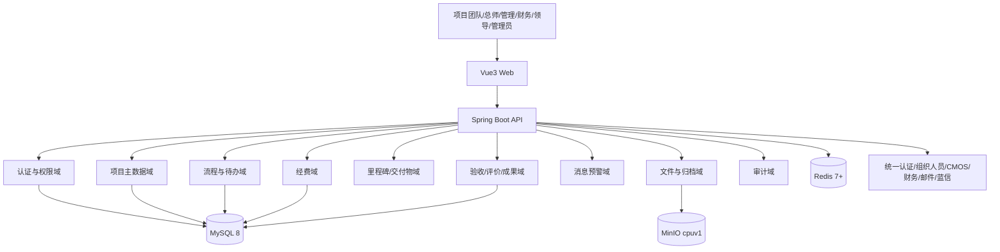
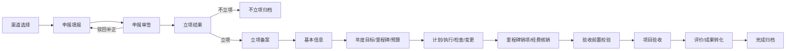

<!-- 本文档由 qa/update-v19-personnel-doc.mjs 基于原 V19.1 文档生成，仅校正人员、单位、职务和项目角色口径。 -->
# 科研项目管理平台完整开发文档（V19.1）

> 文档版本：1.1  
> 编制日期：2026-09-10  
> 核心依据：《全生命周期流程节点责任人与填报上传信息说明_V19.1》  
> 配套依据：《人员角色权限与节点权限说明_V19.1》《科研项目管理平台-分角色个性化页面开发方案》  
> 文档用途：项目立项、产品设计、架构设计、研发实施、测试验收、部署运维和权限审计。

---

## 1. 文档目标与结论

本平台建设为“统一项目主数据、配置化流程、分角色工作台、全过程材料归档、精细化权限、全链路审计”的科研项目全生命周期管理平台，覆盖项目申报、审签、立项、实施、计划、里程碑、经费、评估检查、变更、验收、协作单位评价、成果转化和归档。

建议采用**前后端分离的模块化单体架构**作为一期落地形态：在单一 Spring Boot 应用内按业务域严格分模块，流程、权限、文件、消息、审计作为平台能力独立封装。该方式比一期直接微服务化更适合当前强事务、强权限、流程规则持续澄清的阶段，能降低部署和联调成本；当访问量或组织边界明确后，可按模块接口拆分为服务。

平台必须坚持以下六项不可突破的基线：

1. 申报岗位人员是后续流程人员绑定的权威来源，人工节点必须解析到具体工号或明确评审组。
2. 权限不是单一 RBAC，而是“角色 × 数据范围 × 项目岗位 × 当前节点 × 业务状态 × 操作/字段/附件授权”的组合判定。
3. 项目团队填报事实、审批意见、正式台账和历史版本分区保存，审批人不得覆盖原始填报。
4. 已生效数据原则上锁定，业务调整走项目变更，录入纠错走数据变更。
5. 列表、详情、统计、搜索、消息、导出和附件接口使用同一权限口径，不能只在前端隐藏按钮。
6. 提交、审批、驳回、撤销、转办、附件替换、备案、回写和权限调整全部可追溯。

---

## 2. 建设特色

### 2.1 以岗位责任驱动流程，而非仅按角色放权

同一角色可能有多人，但仅申报或流程模板中为当前项目指定的人员可办理节点。例如，多名二级总师均具备角色身份，只有项目绑定的二级总师可以审核本项目。流程发起时保存岗位快照，后续人员变化通过岗位变更或正式转办处理，不篡改历史办理人。

### 2.2 同一项目、同一事实、不同角色视角

平台只维护一套项目事实，但按角色呈现不同首页、默认字段、操作入口和数据范围：项目团队看待办与材料，总师看技术指标与意见闭环，管理团队看进度风险，财务团队看预算核销，公司领导看态势，管理员看配置和审计。

### 2.3 渠道模板决定表单、材料和审批链

不同国家级、地方级、公司级渠道不强行共用一条流程。渠道模板同时配置适用层级、动态字段、必传材料、节点顺序、办理人解析规则、会签规则、前置校验和结果动作。模板发布后形成版本；运行中的流程固定引用发布版本，后续修改不影响历史实例。

### 2.4 业务基线、执行数据和变更版本分离

年度目标、里程碑、预算、交付物经审批后形成正式基线。实施过程产生进度、佐证、核销和预警。变更审批通过后生成新版本并保留前后差异，保证“当前值可用、历史值可查、变更依据可审”。

### 2.5 材料全版本归档

MinIO 保存文件对象，关系数据库保存文件元数据、业务关联、材料类型、版本、密级、上传人、校验值和权限标识。附件替换新增版本，不覆盖或删除原对象；下载和预览均进行实时鉴权并记录审计。

### 2.6 待办、消息、审批和业务状态同源

流程节点、待办红点、消息通知、“我的已办”和审批轨迹由同一流程事件生成，禁止各模块独立计算造成数量不一致。消息只携带接收人有权看到的摘要，详情仍需二次鉴权。

---

## 3. 建设范围

### 3.1 本期范围

- 组织、人员、账号、岗位、角色、数据范围和授权管理；
- 渠道、动态表单、材料目录、流程模板和评审组配置；
- 角色个性化首页、统一待办、已办、消息与预警；
- 项目申报、常规及特殊渠道审签、立项结果、立项备案；
- 项目基本信息、年度目标、里程碑、计划、交付物；
- 经费预算、核销、执行与异常核查；
- 评估检查、整改、项目变更、数据变更；
- 验收前置校验、分级验收、协作单位评价；
- 成果包、成果转化、后评价、项目完成归档；
- 项目台账、管理驾驶舱、财务看板、授权导出；
- 附件版本、操作审计、流程审计、接口审计；
- CMOS、组织人员、统一认证、邮件/蓝信等外部系统的接口能力。

### 3.2 边界说明

- 平台承担项目统筹、流程办理、材料归集和监督分析，不替代科研团队的专业研发工具。
- 不在普通编辑页面直接改写已审批事实；不以管理员身份代替业务审批。
- 一期不建设通用低代码平台，只实现本项目所需的渠道、字段、材料、流程和权限配置能力。
- 经费支付不在平台直接执行；平台记录预算、核销、凭证、拨付状态并与财务数据对接。

---

## 4. 技术架构

### 4.1 技术栈

| 层次 | 技术选型 | 用途 |
|---|---|---|
| 前端 | Vue 3、Vite 5、TypeScript | 单页应用、工程构建、类型约束 |
| UI | Ant Design Vue 4 | 表格、表单、步骤条、弹窗、上传等统一交互 |
| 状态 | Pinia | 用户、角色视角、字典、权限、待办计数等客户端状态 |
| 图表 | ECharts | 驾驶舱、风险、进度、经费和成果分析 |
| 后端 | Java 17/21、Spring Boot 3.2 | REST API、业务编排、事务、安全与集成 |
| 持久层 | MyBatis-Plus 3.5.7 | 数据访问、分页、审计字段和数据范围拦截 |
| 安全 | Spring Security、JWT | 认证、接口鉴权、方法级授权 |
| 缓存/会话 | Redis 7 协议兼容版本，当前实测 8.x | 会话、JWT 撤销、权限缓存、幂等、防重、待办计数 |
| 文件 | MinIO SDK，部署优先 `*-cpuv1` 镜像 | 附件对象存储、版本、预览和下载 |
| 数据库 | 建议 MySQL 8.0 | 业务数据、流程数据、权限、审计和文件元数据 |
| API | REST/JSON、OpenAPI 3 | 前后端契约与联调 |
| 测试 | Vitest、Vue Test Utils、JUnit 5、Spring Boot Test、Testcontainers、Playwright | 单元、集成、权限和端到端测试 |

Java 21 适合作为新建环境默认版本；若部署环境统一为 Java 17，则所有代码和依赖以 Java 17 兼容为准，不在同一环境混用编译目标。

### 4.2 总体架构



### 4.3 后端模块边界

| 模块 | 主要职责 | 不承担的职责 |
|---|---|---|
| `system` | 组织、用户、角色、岗位、字典、菜单、参数 | 业务审批 |
| `auth` | 登录、JWT、会话、权限决策、数据范围 | 项目业务规则 |
| `channel` | 渠道、表单、材料、流程模板及版本 | 运行实例数据 |
| `project` | 项目主档、团队岗位、台账、项目状态 | 审批任务调度 |
| `workflow` | 实例、节点、任务、会签、转办、撤销、轨迹 | 覆盖业务主数据 |
| `milestone` | 年度目标、里程碑、进展、预警、销项 | 经费核销 |
| `plan` | CMOS 计划同步、办结申请、状态 | 外部 CMOS 主数据维护 |
| `finance` | 预算、支出、核销、额度、异常 | 技术指标维护 |
| `inspection` | 评估、检查、整改闭环 | 项目变更 |
| `change` | 项目变更、数据纠错、受控字段回写 | 无审批直接更新 |
| `acceptance` | 前置校验、验收、分级材料、结论 | 财务审核替代 |
| `partner` | 参研/外协单位评价、黑名单衔接 | 直接解除限制 |
| `achievement` | 交付物、成果包、转化、后评价 | 修改成果权属结论 |
| `file` | MinIO 对象、元数据、版本、预览、下载 | 绕过业务授权 |
| `message` | 待办通知、站内信、外部消息、预警 | 作为权限依据 |
| `report` | 台账、驾驶舱、统计、受控导出 | 保存第二套业务事实 |
| `audit` | 操作、权限、流程、下载和接口审计 | 修改审计历史 |

### 4.4 前端工程建议

```text
src/
├─ api/                 # 按业务域定义接口和 DTO
├─ components/          # 通用表单、附件、流程轨迹、权限按钮
├─ composables/         # 分页、权限、字典、上传、导出等组合逻辑
├─ layouts/             # 主框架与角色工作台布局
├─ router/              # 静态路由、动态菜单、路由守卫
├─ stores/              # user、permission、dict、task、app
├─ views/
│  ├─ workspace/        # 各角色首页
│  ├─ project/          # 项目与台账
│  ├─ workflow/         # 待办、已办、审批详情
│  ├─ milestone/ plan/ finance/ inspection/ change/
│  ├─ acceptance/ partner/ achievement/ report/
│  └─ system/           # 系统配置与审计
├─ types/               # 业务枚举、接口类型、权限类型
└─ utils/               # 请求、日期、金额、脱敏、下载
```

所有业务页面统一使用“列表—详情—填报/审批—流程轨迹—材料版本”交互骨架。按钮权限由后端返回的 `allowedActions` 控制，但提交时后端必须重新判定。

---

## 5. 人员、组织与角色设计

### 5.1 人员信息模型

人员至少维护：工号、姓名、账号、所属组织、部门、岗位、联系方式、在岗状态、角色集合、任职有效期、密级/资料级别、创建来源和同步时间。工号为业务匹配主键；姓名仅用于展示和辅助核对。

项目岗位单独建模，不直接等同于平台角色：项目联系人、项目负责人、技术负责人、项目主管、项目承担部门负责人、一级总师、二级总师、单位科技主管/部长、单位分管领导、单位财务主管/部长、总部处室主管/处长、总部财务主管等均需保存项目级绑定和有效期。

“责任总师”是一级总师和二级总师的统称。一级总师承担公司级技术统筹与重大风险把关，二级总师承担单位级或具体专业项目的技术审核；两者都只办理分派给本人的节点，不因具有责任总师身份而查看或审批全部项目。

### 5.2 角色与个性化入口

| 人员类别 | 默认首页 | 默认数据范围 | 核心能力 |
|---|---|---|---|
| 项目团队 | 我的工作台 | 本人负责或授权参与项目 | 申报、填报、补正、验收发起、成果维护 |
| 一级/二级总师 | 技术评审工作台 | 本人经手和被分派项目 | 技术审查、意见、整改跟踪 |
| 单位管理团队 | 单位管理工作台 | 本单位授权项目 | 初审、检查、督办、单位台账 |
| 总部管理团队 | 可视化驾驶舱 | 全公司或责任处室范围 | 统筹、审批、备案、风险和分析 |
| 单位财务团队 | 经费执行工作台 | 本单位项目经费 | 预算审核、凭证、核销、异常 |
| 总部财务团队 | 总部拨付工作台 | 总部职责范围经费 | 复核、额度、拨付、清算监督 |
| 公司领导 | 决策驾驶舱 | 授权公司范围 | 只读态势、风险、统计 |
| 评审人员 | 受邀评审台 | 指定项目和有效时段 | 查看指定材料、提交评审意见 |
| 超级管理员 | 平台管理中心 | 运维所需只读范围 | 配置、账号、权限、流程、审计 |

### 5.3 多角色切换

用户兼任多个角色时，前端显示当前工作身份。切换身份只改变菜单、首页和默认数据范围，不合并放大单一身份权限。涉及申请人与终审人同一人的情形，系统按职责分离规则阻断或转交其他获授权人员。

### 5.4 入转调离

- 入职/新增：组织同步或管理员按批准单创建账号并授权。
- 调岗：关闭旧岗位后续办理权，建立新岗位有效期，未结任务通过正式转办处理。
- 离岗：立即停用登录和业务办理权，原则上 7 个工作日内完成账号注销或交接。
- 历史数据：永远保留当时人员姓名、工号、组织、岗位和办理结果快照。

### 5.5 演示人员账号

本节账号及姓名均为**虚构演示数据**，仅用于产品演示、流程联调和验收培训，不代表实际组织人员。账号和初始密码统一采用六位纯数字；为便于现场演示，初始密码与账号相同。该弱密码规则只允许在与生产网络隔离的演示环境使用，测试、UAT 和生产环境必须使用统一认证或符合安全策略的独立密码。


#### 5.5.1 核心业务人员

> 人员口径调整说明：本节实际演示人员已按《现有人员部门角色权限清单.md》校正。系统账号角色、主部门、职务身份和项目岗位以当前运行平台快照为准；特殊渠道人员、外部评审组和单位分管领导在该清单中未出现，仍作为待配置演示资源保留。

| 序号 | 账号 | 初始密码 | 姓名 | 所属组织 | 主部门 | 任职身份/职务 | 系统角色包 | 项目岗位 | 主要演示职责 |
|---:|---:|---:|---|---|---|---|---|---|---|
| 1 | `100001` | `100001` | 系统管理员 | 中国商飞总部 | 科研项目处 | 系统管理员 | 超级管理员 | 暂无项目角色 | 权限配置、流程模板维护、数据运维、经授权登记立项结果 |
| 2 | `100002` | `100002` | 周明远 | 中国商飞总部 | 科技管理部（总部办公室） | 公司领导 | 管理团队 | 暂无项目角色 | 公司级项目态势、台账、风险和统计分析只读查看 |
| 3 | `100003` | `100003` | 王建国 | 中国商飞总部 | 总部科技部科研项目处 | 总部责任处室处长 | 管理团队 | 总部处室处长 | 总部责任部门审批、科研项目处审核备案、终审和项目统筹 |
| 4 | `100004` | `100004` | 何雨桐 | 中国商飞总部 | 科研项目处 | 总部科研项目主管 | 管理团队 | 总部处室主管 | 材料核验、管理审核、备案协同和督办 |
| 5 | `100005` | `100005` | 方致远 | 上飞院 | 科技管理部 | 单位科研管理部门负责人 | 管理团队 | 单位科技部长 | 单位科技部门审核、单位管理确认和整改督办 |
| 6 | `100006` | `100006` | 田念慈 | 上飞院 | 科技管理部 | 单位项目主管 | 管理团队 | 单位科技主管 | 计划、检查、管理材料、备案协同和单位初核 |
| 7 | `100007` | `100007` | 陈铁军 | 中国商飞总部 | 科技管理部（总部办公室） | 一级总师（公司级） | 责任总师 | 一级总师 | 公司级技术审核和重大项目验收技术复核 |
| 8 | `100008` | `100008` | 蔡文渊 | 上飞院 | 科技管理部 | 二级总师（单位级） | 责任总师 | 二级总师 | 单位级技术审核、本人经手项目技术把关 |
| 9 | `100009` | `100009` | 赵美玲 | 中国商飞总部 | 财务部 | 总部财务主管 | 财务团队 | 总部财务主管 | 预算复核备案、拨付审核和异常核查 |
| 10 | `100010` | `100010` | 毕仲文 | 上飞院 | 财务部 | 单位财务部长 | 财务团队 | 单位财务部长 | 本单位申报经费、预算及核销审核 |
| 11 | `100011` | `100011` | 龚雪君 | 上飞院 | 财务部 | 单位财务主管 | 财务团队 | 单位财务主管 | 付款凭证上传、经费核销经办和数据核对 |
| 12 | `100012` | `100012` | 林晚晴 | 上飞院 | 科研项目处 | 项目负责人 | 项目团队 | 项目负责人 | 项目总体负责、项目基本信息确认、里程碑销项提交、验收发起 |
| 13 | `100013` | `100013` | 顾思远 | 上飞院 | 科研项目处 | 项目联系人 | 项目团队 | 项目联系人 | 选择渠道、创建申报、维护人员、上传材料、驳回后补正 |
| 14 | `100014` | `100014` | 沈知行 | 上飞院 | 科研项目处 | 技术负责人 | 项目团队 | 技术负责人 | 年度目标、里程碑、交付物和技术佐证材料填报 |
| 15 | `100015` | `100015` | 陆嘉言 | 上飞院 | 科研项目处 | 项目主管 | 项目团队 | 项目主管 | 计划办结、评估检查、项目变更和过程信息填报 |
| 16 | `100016` | `100016` | 韩承泽 | 上飞院 | 总体气动部 | 项目承担部门负责人 | 管理团队 | 项目承担部门负责人 | 审核项目必要性、部门承担能力、人员和材料完整性 |

#### 5.5.2 特殊渠道演示人员

| 序号 | 账号 | 初始密码 | 演示姓名 | 所属组织 | 演示岗位 | 适用渠道/节点 |
|---:|---:|---:|---|---|---|---|
| 19 | `100019` | `100019` | 蒋哲 | 专业总师团队 | 三级专业总师 | 科技周三级专业总师审核 |
| 20 | `100020` | `100020` | 冯毅 | 专业总师团队 | 二级专业总师 | 科技周二级专业总师审核 |
| 21 | `100021` | `100021` | 段然 | 北研中心科技部 | 北研中心科技部主管 | 中国商飞—波音项目主管审核 |
| 22 | `100022` | `100022` | 卢浩 | 北研中心科技部 | 北研中心科技部部长 | 中国商飞—波音项目部长审核 |
| 23 | `100023` | `100023` | 戴峰 | 北研中心 | 北研中心分管领导 | 中国商飞—波音项目单位复核 |
| 24 | `100024` | `100024` | 梁睿 | 公司评审专家库 | 评审专家/组长 | 技术发展战略委员会、联盟专委会 |
| 25 | `100025` | `100025` | 孔博 | 公司评审专家库 | 评审专家/组长 | 学术委员会、技术发展战略委员会 |
| 26 | `100026` | `100026` | 苏岚 | 公司评审专家库 | 评审专家 | 学术委员会、理事会、技术发展战略委员会 |
| 27 | `100027` | `100027` | 任杰 | 公司评审专家库 | 评审专家 | 学术委员会、理事会 |
| 28 | `100028` | `100028` | 彭越 | 公司评审专家库 | 评审专家/组长 | 理事会、联盟专委会 |
| 29 | `100029` | `100029` | 夏清 | 公司评审专家库 | 评审专家 | 联盟专委会 |


#### 5.5.3 常规申报流程账号映射

演示项目默认使用当前运行平台项目岗位人员，由以下账号绑定常规申报链。绑定在项目申报提交时形成岗位快照，流程不得仅凭角色名称重新匹配人员。

| 流程顺序 | 流程节点 | 指定账号 | 姓名 | 人员来源 |
|---:|---|---:|---|---|
| 1 | 项目联系人填报 | `100013` | 顾思远 | 申报岗位：项目联系人 |
| 2 | 项目负责人审核 | `100012` | 林晚晴 | 申报岗位：项目负责人 |
| 3 | 项目承担部门负责人审核 | `100016` | 韩承泽 | 申报岗位：项目承担部门负责人 |
| 4 | 二级总师审核 | `100008` | 蔡文渊 | 申报岗位：二级总师 |
| 5 | 单位财务部门负责人审核 | `100010` | 毕仲文 | 申报岗位：单位财务部长；XX25 自动跳过 |
| 6 | 单位科技部门负责人审核 | `100005` | 方致远 | 申报岗位：单位科技部长 |
| 7 | 单位分管领导审核 | 待配置 | 待配置 | 当前人员清单未提供单位分管领导账号 |
| 8 | 一级总师审核 | `100007` | 陈铁军 | 申报岗位：一级总师 |
| 9 | 总部科技部科研项目处审核 | `100003` | 王建国 | 渠道归口：总部处室处长 |
| 10 | 线下报批材料归档 | `100004` | 何雨桐 | 渠道归口：总部处室主管 |
| 11 | 立项结果登记 | `100001` | 系统管理员 | 正式授权的立项结果办理人 |

演示“项目负责人本人提交”场景时，由 `100012` 提交申报，但系统仍为 `100012` 生成项目负责人审核任务；该账号需再次进入“待我审核”完成负责人节点。演示驳回场景时，任一审核账号驳回后，应由 `100013` 收到补正待办。


#### 5.5.4 实施、经费、验收和成果演示账号映射

| 业务事项 | 填报/发起账号 | 审核/确认账号 | 预期结果 |
|---|---|---|---|
| 项目基本信息补充 | `100013`/ `100012` | `100012` → `100016` → `100005` → `100003` | 终审通过后更新正式项目台账 |
| 年度目标与里程碑 | `100014`/ `100012` | `100006` 或 `100005` | 形成年度基线并启动四色预警 |
| 计划办结 | `100015` | `100005` | 计划由待办转为已完成 |
| 经费预算 | `100012`/ `100015` | `100010` → `100009` | 预算生效并绑定里程碑 |
| 经费核销 | `100011`/ `100010` | `100010`，完成本级核销后同步总部经费看板 | 更新累计支出和剩余预算 |
| 评估检查 | `100015` | `100006`/ `100005` → `100004`/ `100003` | 归档结论或启动整改 |
| 项目/数据变更 | `100015`/ `100012` | `100005` → `100003` | 通过后版本化回写受控字段 |
| 项目验收 | `100012` | `100005` → `100007`（适用时）→ `100003` | 归档验收结论并启动评价倒计时 |
| 交付物确认 | `100014`/ `100012` | `100005` → `100003` | 已交付成果可进入成果包 |
| 协作单位评价 | `100013`/ `100012` | `100005` → `100003` | 形成评价等级和处理记录 |
| 成果转化 | `100012`/ `100014` | `100005` → `100004`/ `100003` | 生成成果编号并同步看板 |

#### 5.5.5 特殊评审组配置

| 评审组 | 演示成员账号 | 演示规则 |
|---|---|---|
| 技术发展战略委员会 | `100024`、`100025`、`100026` | `100024` 为组长；至少 2 人提交且通过票不少于 2 票 |
| 学术委员会 | `100025`、`100026`、`100027` | `100025` 为组长；三人会签，通过票不少于 2 票 |
| 理事会 | `100026`、`100027`、`100028` | `100028` 为组长；三人会签，通过票不少于 2 票 |
| 联盟专委会 | `100024`、`100028`、`100029` | `100024` 为组长；三人会签，通过票不少于 2 票 |

以上会签人数和通过条件仅作为演示配置，用于验证组织型节点的成员、意见、会签和汇总能力；正式模板必须以批准的业务制度为准。

#### 5.5.6 演示账号初始化规则

1. 账号、初始密码和演示工号均使用表中的六位数字，例如账号、密码和工号均为 `100001`。
2. 演示环境可关闭首次登录强制改密，便于多人轮流演示；演示环境不得连接生产数据。
3. 同一浏览器切换账号前必须退出登录并清理当前会话，避免角色工作台和权限缓存串用。
4. `100016` 的超级管理员身份不自动获得业务审批权；立项结果登记来自单独授予的 `project:establishment:register` 权限。
5. `100017` 仅用于领导驾驶舱只读演示；`100018` 仅在评审任务有效期内可查看指定项目材料。
6. 正式测试应增加“同角色非指定人”账号，用于验证仅有角色但未绑定项目岗位时无法审批。

---

## 6. 权限体系设计

### 6.1 权限判定公式

一次业务操作允许执行，当且仅当：

```text
Allow = 账号有效
     ∧ 具备功能/操作权限
     ∧ 命中数据范围
     ∧ 命中项目岗位或专项授权
     ∧ 是当前节点指定人员/有效评审组成员
     ∧ 当前业务状态允许
     ∧ 字段及附件级权限允许
     ∧ 不违反职责分离规则
```

权限判断统一封装为后端策略服务，在 Controller 入口、Service 业务动作、MyBatis 数据范围和文件下载四处落实。前端权限仅用于优化体验，不作为安全边界。

### 6.2 权限层级

| 层级 | 示例 | 实现方式 |
|---|---|---|
| 菜单 | 是否显示经费管理 | 角色—菜单授权 |
| 操作 | 新建、编辑、提交、审批、撤销、转办、导出 | 权限码 + 方法鉴权 |
| 数据范围 | 全公司、责任处室、本单位、本人经手、专项业务 | SQL 数据范围策略 |
| 项目岗位 | 是否为本项目二级总师/负责人 | 项目岗位绑定校验 |
| 流程节点 | 是否为当前任务受理人 | 任务实例工号/候选组校验 |
| 状态 | 草稿可编辑、审批中只读、归档锁定 | 状态机校验 |
| 字段 | 财务只见必要技术摘要，不能改技术字段 | 字段策略与 DTO 裁剪 |
| 附件 | 可查看不一定可下载，评审授权有期限 | 文件业务关联授权 |
| 导出 | 本单位台账或责任范围统计 | 独立导出权限 + 二次数据过滤 |

### 6.3 典型权限矩阵

| 操作 | 项目团队 | 总师 | 单位管理 | 总部管理 | 财务 | 领导 | 管理员 |
|---|---|---|---|---|---|---|---|
| 原始业务填报 | 按项目分工 | 否 | 否 | 否 | 仅财务内容 | 否 | 否 |
| 当前节点审批 | 仅配置节点 | 本人技术节点 | 本人管理节点 | 本人总部节点 | 本人财务节点 | 原则上否 | 否 |
| 项目查看 | 本人关联 | 本人经手 | 本单位 | 责任范围 | 经费相关 | 授权只读 | 运维只读 |
| 附件下载 | 按项目和材料授权 | 评审所需 | 职责范围 | 职责范围 | 财务所需 | 专项授权 | 运维专项授权 |
| 数据导出 | 无全量 | 原则无全量 | 授权本单位 | 授权责任范围 | 财务范围 | 专项授权 | 运维授权 |
| 配置流程/权限 | 否 | 否 | 申请 | 批准/申请 | 申请 | 否 | 按批准结果维护 |

### 6.4 安全规则

- 禁止通过猜测项目 ID、文件 ID 或流程 ID 越权访问；所有资源接口先做对象级鉴权。
- JWT 使用短有效期访问令牌；Redis 保存会话、刷新令牌标识、撤销状态和账号版本。
- 权限、岗位或账号变化时提升账号版本，立即使旧令牌失效。
- 高风险操作如导出、权限调整、批量下载和流程模板发布应支持二次确认并记录原因。
- 敏感字段按职责脱敏；日志禁止记录令牌、密码、完整身份证号和文件正文。

---

## 7. 信息架构与页面设计

### 7.1 一级导航

1. 工作台：角色首页、我的待办、我的已办、我的消息、我的预警。
2. 项目管理：项目申报、项目台账、项目详情、项目立项。
3. 实施管理：年度目标、里程碑、计划、评估检查、整改、项目/数据变更。
4. 经费管理：预算、执行、核销、额度、拨付、异常。
5. 验收管理：前置检查、验收申请、分级验收、材料归档。
6. 成果管理：交付物、协作单位评价、成果包、成果转化、后评价。
7. 分析监督：驾驶舱、风险预警、单位督办、统计报表、授权导出。
8. 平台管理：组织人员、角色权限、渠道、表单、材料、流程、字典、审计。

导航根据当前身份和权限动态生成，无权模块既不显示菜单，也不能通过 URL 访问。

### 7.2 首页布局规则

- 顶部：本人范围的项目数、待办数、逾期数、临期数和关键金额指标。
- 中部首屏：逾期待办、临期待办、退回补正、当前审批任务。
- 中部次屏：项目进度、风险分布、经费执行或技术意见跟踪等角色指标。
- 底部：近期已办、消息、常用入口、制度或模板下载。
- 排序：红色逾期 > 黄色临期 > 退回补正 > 普通待办；同级按截止时间升序。

### 7.3 项目详情

项目详情保持统一事实，使用页签控制呈现：概览、团队与岗位、申报立项、年度目标、里程碑、计划、经费、评估整改、变更、验收、交付物、评价、成果转化、材料、流程轨迹、操作审计。不同角色默认打开不同页签并只展示获授权字段和动作。

### 7.4 通用页面组件

- `PermissionAction`：根据后端 `allowedActions` 展示动作按钮；
- `DynamicFormRenderer`：按渠道表单版本渲染字段、校验和分组；
- `MaterialChecklist`：材料齐套、必传、版本、状态和下载权限；
- `WorkflowTimeline`：节点、办理人、意见、时间、版本、退回路径；
- `ProjectRoleSelector`：按组织、岗位和工号选择并校验人员；
- `MilestoneStatusTag`：统一蓝黄红绿状态；
- `ChangeDiffViewer`：变更前后字段和附件差异；
- `PrecheckPanel`：验收条件逐项校验并提供修复入口。

---

## 8. 全生命周期业务流程

### 8.1 主流程



### 8.2 28 个节点责任与结果摘要

| 节点 | 业务节点 | 主要责任人 | 主要信息/材料 | 完成结果 |
|---:|---|---|---|---|
| 1 | 选择项目渠道 | 联系人/负责人/授权团队人员 | 层级、渠道、专业、单位 | 加载表单、材料和流程模板 |
| 2 | 申报信息与材料 | 联系人牵头，团队协同 | 目标、周期、经费、团队、渠道材料 | 申报单、岗位快照、流程实例 |
| 3 | 项目负责人审核 | 申报指定负责人 | 全部申报信息和材料 | 通过或退回填报 |
| 4 | 承担部门负责人审核 | 指定部门负责人 | 必要性、能力、人员 | 进入技术审核 |
| 5 | 二级总师审核 | 指定二级总师 | 技术方案、目标、材料 | 技术意见 |
| 6 | 单位财务负责人审核 | 单位财务部长；XX25 跳过 | 经费、预算依据 | 财务意见 |
| 7 | 单位科技负责人审核 | 单位科技部长 | 合规、渠道、单位意见 | 单位管理意见 |
| 8 | 单位分管领导审核 | 单独配置的分管领导 | 必要性、资源投入 | 单位复核意见 |
| 9 | 一级总师审核 | 指定一级总师 | 公司技术方向、风险 | 公司级技术意见 |
| 10 | 总部科研项目处审核 | 渠道归口主管/处长 | 全资料及前序意见 | 总部意见 |
| 11 | 线下报批材料归档 | 总部科技经办 | 报批文件、批复材料 | 线下过程可追溯 |
| 12 | 立项结果登记 | 授权结果办理人 | 立项结果、日期、正式依据 | 进入立项或不立项归档 |
| 13 | 立项备案 | 项目团队，负责人提交 | 任务书、批复、通知、合同 | 正式项目、岗位同步 |
| 14 | 基本信息补充 | 项目团队 | 编号、目标、周期、团队等 | 审批后更新正式台账 |
| 15 | 年度目标与里程碑 | 技术负责人牵头 | 目标、节点、日期、预算、交付物 | 年度基线和预警启动 |
| 16 | 里程碑预警与执行 | 项目团队/管理督办 | 进度、原因、措施、过程佐证 | 动态状态和预警记录 |
| 17 | 里程碑完成审核 | 技术负责人/负责人 | 实际日期、结论、试验/验收证明 | 节点闭环转绿 |
| 18 | 计划同步与办结 | CMOS/项目团队 | 计划、办结说明和证明 | 已完成计划 |
| 19 | 经费预算 | 项目团队 | 年度、里程碑、科目、金额、依据 | 预算生效并入台账 |
| 20 | 经费核销 | 单位财务主管/经办 | 支出、凭证、发票、结算单 | 支出/结余更新并同步总部 |
| 21 | 评估检查 | 项目团队/渠道管理人员 | 按渠道的评估检查材料 | 结论归档或整改启动 |
| 22 | 项目/数据变更 | 项目团队 | 前后值、原因、影响、佐证 | 审批后版本化回写 |
| 23 | 验收前置校验 | 系统自动 | 里程碑、交付物、经费、整改、材料 | 通过后开放验收提交 |
| 24 | 项目验收 | 项目负责人发起 | 分级验收材料、达成情况 | 验收结论、评价倒计时 |
| 25 | 交付物确认 | 项目团队 | 类型、状态、权属、证明 | 可入成果包的交付物 |
| 26 | 协作单位评价 | 团队、单位和总部管理 | 五维评分、依据、问题佐证 | 评价等级及黑名单衔接 |
| 27 | 成果转化 | 项目团队 | 成果包、方式、时间、进展、佐证 | 唯一成果编号、看板同步 |
| 28 | 项目完成归档 | 团队整理，两级管理确认 | 全过程清单、最终材料、凭证 | 项目只读归档 |

### 8.3 常规申报链

适用于 MJKY、04 专项接续、重点研发计划、国家自然科学基金、揭榜挂帅、科技创新行动计划、预研三年滚动计划和新疆大飞机气象创新中心：

```text
项目联系人填报
→ 项目负责人
→ 项目承担部门负责人
→ 二级总师
→ 单位财务部门负责人（XX25 跳过）
→ 单位科技部门负责人
→ 单位分管领导
→ 一级总师
→ 总部科技部科研项目处
→ 线下报批/立项结果登记
```

项目负责人本人提交时仍进入项目负责人审核节点。任何驳回均回到规定补正人，原提交和审批意见不得覆盖。

### 8.4 特殊渠道

科技周、大飞机研究院、大飞机先进材料创新联盟、中国商飞—波音可持续航空技术研究中心分别建立独立模板。委员会、理事会、专委会等组织型节点必须配置成员、主持人、会签方式、最低通过条件、缺席处理、意见汇总人和会议材料；不得以固定单人账号兜底。

### 8.5 状态与预警

| 状态 | 规则 |
|---|---|
| 绿色 | 已完成且完成审核 |
| 蓝色 | 未完成，距截止日超过 30 天 |
| 黄色 | 未完成，距截止日不超过 30 天，含截止日 |
| 红色 | 已超过截止日且未完成 |

项目聚合状态按红、黄、蓝、绿优先级取最高风险。无有效截止日期的事项不得仅因日期为空判为逾期。预警已读不代表问题关闭，只有关联业务闭环才解除当前预警，历史处理记录继续保留。

---

## 9. 表单、信息与材料设计

### 9.1 动态表单模型

渠道表单由表单模板、表单版本、字段分组、字段定义、校验规则、显示条件、读写策略和业务映射组成。动态字段用于渠道差异，项目名称、编号、渠道、组织、团队、周期、经费等核心字段使用结构化主表，避免全部存入 JSON 后难以查询和授权。

### 9.2 关键信息域

| 信息域 | 核心信息 |
|---|---|
| 项目主档 | 项目编号、名称、层级、渠道、专业、组织、周期、状态 |
| 项目团队 | 岗位编码、工号、姓名、组织、有效期、来源版本 |
| 申报立项 | 目标、内容、经费、参研单位、申报单、批复结果 |
| 年度目标 | 年度、目标内容、版本、审批状态 |
| 里程碑 | 名称、计划/实际日期、预算、进度、状态、交付物 |
| 计划 | 外部计划号、来源、责任人、期限、办结状态 |
| 经费 | 预算年度、科目、来源、金额、支出、凭证、结余 |
| 评估整改 | 类型、结论、问题、责任人、期限、整改证据 |
| 变更 | 变更类型、前值、后值、原因、影响、审批版本 |
| 验收 | 层级、类型、申请、前置校验、材料、结论 |
| 交付物 | 名称、类型、考核指标、状态、权属、成果编号 |
| 协作评价 | 单位、类型、五维评分、总分、等级、依据 |
| 成果转化 | 成果编号、成果包、方式、状态、时间、责任单位 |
| 审计 | 操作者、工号、动作、对象、前后值、时间、来源 IP |

### 9.3 材料目录

渠道材料目录配置材料编码、名称、业务阶段、必传性、允许格式、大小上限、份数、是否可替换、可见角色、可下载角色、保密级别和归档期限。主要渠道材料以 V19.1 清单为基线，包括建议书、申请书、任务清单、评审意见、立项批复、批准/立项通知、会议纪要、任务书、合同、年度目标与里程碑清单、预算依据、试验/验收证明、付款凭证、评价报告和成果转化佐证等。

#### 9.3.1 各渠道申报与立项材料基线

| 项目级别 | 项目渠道 | 申报阶段材料 | 立项阶段材料 |
|---|---|---|---|
| 国家级 | MJKY | 建议书、建议书意见 | 立项批复 |
| 国家级 | 04 专项接续 | 建议书、建议书意见 | 立项批复 |
| 国家级 | 重点研发计划 | 申请书、申请书评审 | 按渠道补充，当前无固定项 |
| 国家级 | XX25 专项 | 申报通知、任务清单、任务清单评估 | 按渠道补充，当前无固定项 |
| 国家级 | 国家自然科学基金 | 申请书、申请书评审 | 批准通知 |
| 地方级 | 揭榜挂帅 | 榜单答疑 | 申请书评审 |
| 地方级 | 科技创新行动计划 | 建议书、建议书评审 | 立项通知 |
| 公司级 | 预研三年滚动计划 | 建议书、建议书评审 | 立项通知 |
| 公司级 | 新疆大飞机气象创新中心 | 申请书、申请书评审、技术委员会/主任委员会/理事会审议材料 | 立项通知 |
| 公司级 | 科技周 | 合作需求、需求对接总结、技术发展战略委员会审议材料 | 拟立项通知、立项文件 |
| 公司级 | 大飞机研究院 | 项目申请书、学术委员会审议材料 | 立项通知 |
| 公司级 | 大飞机先进材料创新联盟 | 项目申请书 | 立项建议清单、专委会意见、理事会意见 |
| 公司级 | 中国商飞—波音可持续航空技术研究中心项目 | 波音指导委员会会议纪要 | 三方合同 |

表中“当前无固定项”不是允许缺失材料，而是由该渠道的已发布材料模板决定；模板未配置完整时不得发布流程。

### 9.4 附件版本规则

1. 前端先申请上传凭证，后端校验业务权限、类型、大小和材料规则。
2. 文件上传 MinIO 临时区后计算 SHA-256，后端确认并生成文件元数据。
3. 每次替换产生新版本，旧版本状态改为历史有效，不物理覆盖。
4. 流程提交时将表单版本和附件版本形成提交快照。
5. 预览、下载、批量打包均走鉴权接口并写下载审计。
6. 归档时对象转入归档前缀或归档桶，并按制度设置保留策略。

建议对象键采用：`{tenant}/{projectId}/{bizType}/{bizId}/{fileId}/v{version}/{safeName}`，数据库不保存对外永久直链，仅生成短时有效的签名访问地址。

---

## 10. 工作流设计

### 10.1 模板对象

流程模板至少包含：模板编码、名称、渠道、业务类型、版本、状态、节点列表、节点类型、办理人解析器、表单/材料权限、通过/驳回路径、会签规则、时限、前置条件、完成动作和发布记录。

### 10.2 节点类型

- 填报节点：创建或补正业务表单和材料；
- 单人审批：绑定具体工号；
- 候选组认领：仅用于制度明确的经办组，认领后锁定到人；
- 会签/评审组：按全票、比例或最低人数形成结果；
- 自动校验：如验收前置条件；
- 自动同步：台账、看板、消息、外部接口；
- 备案/结果登记：记录正式结果，不替代审批；
- 归档节点：冻结业务版本并生成归档清单。

### 10.3 办理人解析优先级

```text
项目岗位快照指定人员
→ 当前有效的项目岗位变更结果
→ 渠道模板指定组织岗位
→ 明确配置的评审组
→ 解析失败并阻止提交
```

不得使用“随机选择同角色人员”或“超级管理员兜底”。解析失败时提示缺失岗位、来源字段和处理入口。

### 10.4 流程动作

| 动作 | 关键规则 |
|---|---|
| 暂存 | 仅保存草稿，不生成待办 |
| 提交 | 校验字段、材料、岗位和幂等键，生成提交快照和首个待办 |
| 通过 | 仅当前办理人执行，关闭当前任务并生成下一任务 |
| 驳回 | 必填原因，关闭当前任务并向规定补正人生成待办 |
| 撤销 | 仅规则允许的发起人和阶段，关闭未办任务并留痕 |
| 转办 | 需具备转办权，记录原人、新人、原因和授权依据 |
| 加签/减签 | 仅组织型节点按模板规则允许，完整记录成员变化 |
| 终止 | 需专项权限和原因，不删除实例和历史任务 |
| 回写 | 仅流程最终通过后，以业务事务方式更新正式数据和版本 |

### 10.5 并发与幂等

任务表使用版本号进行乐观锁；审批接口要求 `taskId + version + idempotencyKey`。Redis 短锁用于防止重复点击，但数据库任务状态和唯一约束是最终一致性依据。重复请求返回首次办理结果，不得生成重复待办或重复回写。

---

## 11. 核心业务规则

### 11.1 里程碑与经费

- 年度目标和里程碑原则上每年 4 月前形成基线。
- 延期不得直接改计划日期，必须走项目变更。
- 对应里程碑完成并审核闭环后，方可办理该节点经费核销。
- 预算按年度、里程碑、科目和资金来源管理；核销不得超过可用预算，超额进入异常核查。
- 经费数据以单位系统接口为优先来源；接口不可用时启用受控人工填报，需记录切换原因和数据来源。

### 11.2 验收前置条件

以下条件全部通过才开放验收提交：全部里程碑闭环、全部核心交付物已交付、外协交付物验收合格、节点预算匹配且核销完成、无在途核销、不合格评估整改闭环、渠道要求验收材料齐全。

### 11.3 协作单位评价

参研单位在项目验收后、外协单位在合同验收后启动，均应在 30 日内完成。评分维度为技术能力、交付质量、进度履约、服务配合、合规性。等级规则：90 分及以上优秀，80 至不足 90 分良好，60 至不足 80 分合格，不足 60 分不合格。不合格仅触发后续处置，不允许普通用户直接变更黑名单状态。

### 11.4 成果转化与后评价

只有已交付成果可进入成果包；成果编号全局唯一并关联来源项目和交付物。转化按计划时间产生四色预警。后评价规则以正式制度配置，当前已明确的范围包括经费超过 1 亿元的项目，办理期限为最终公司验收后 3 年内。

---

## 12. 数据库设计

### 12.1 核心表建议

| 领域 | 核心表 |
|---|---|
| 组织权限 | `sys_user`、`sys_org`、`sys_position`、`sys_role`、`sys_permission`、`sys_user_role`、`sys_role_permission`、`sys_data_scope` |
| 渠道配置 | `cfg_channel`、`cfg_form_template`、`cfg_form_field`、`cfg_material_rule`、`cfg_flow_template`、`cfg_flow_node`、`cfg_reviewer_group` |
| 项目 | `pm_project`、`pm_project_version`、`pm_project_role`、`pm_application`、`pm_establishment` |
| 流程 | `wf_instance`、`wf_task`、`wf_task_actor`、`wf_action_log`、`wf_submission_snapshot` |
| 目标执行 | `pm_annual_target`、`pm_milestone`、`pm_milestone_progress`、`pm_plan`、`pm_inspection`、`pm_rectification` |
| 经费 | `fin_budget`、`fin_budget_item`、`fin_expense`、`fin_writeoff`、`fin_allocation`、`fin_exception` |
| 变更 | `pm_change_request`、`pm_change_item`、`pm_data_correction` |
| 验收成果 | `pm_acceptance`、`pm_acceptance_check`、`pm_deliverable`、`pm_partner_evaluation`、`pm_achievement`、`pm_transformation`、`pm_post_evaluation` |
| 文件消息 | `sys_file`、`sys_file_version`、`sys_file_relation`、`sys_message`、`sys_notification_outbox`、`sys_warning` |
| 审计集成 | `sys_audit_log`、`sys_login_log`、`sys_export_task`、`sys_integration_log`、`sys_idempotency` |

### 12.2 通用字段

业务表统一包含 `id`、`tenant_id`（若确定单租户可保留默认值）、`org_id`、`created_by`、`created_at`、`updated_by`、`updated_at`、`version`、`deleted`。受控业务表增加 `biz_status`、`flow_instance_id`、`effective_version`。审计和流程历史表禁止逻辑删除入口。

### 12.3 数据一致性

- 所有金额使用 `DECIMAL`，后端使用 `BigDecimal`，禁止浮点数。
- 时间数据库统一保存带明确时区语义的时间，前端按 Asia/Shanghai 展示。
- 项目编号、申报单号、成果编号、渠道编码和流程业务键设唯一约束。
- 流程终审和业务回写在同一数据库事务完成；外部消息通过 Outbox 异步发送。
- 报表从业务主表和授权视图聚合，不人工维护第二套口径。

---

## 13. API 设计

### 13.1 规范

- 前缀：`/api/v1`；资源名使用复数名词。
- 返回统一包含 `code`、`message`、`data`、`traceId`。
- 分页使用 `pageNo`、`pageSize`，默认 20，最大值由后台配置。
- 写接口携带幂等键；更新携带版本号以校验并发。
- 错误码区分参数错误、无认证、无权限、状态冲突、岗位缺失、材料缺失、重复提交和系统异常。

### 13.2 关键接口组

| 接口组 | 示例 |
|---|---|
| 登录会话 | `POST /auth/login`、`POST /auth/refresh`、`POST /auth/logout` |
| 当前用户 | `GET /users/me`、`GET /users/me/work-contexts`、`PUT /users/me/context` |
| 工作台 | `GET /workspaces/summary`、`GET /tasks/my-pending`、`GET /tasks/my-done` |
| 项目申报 | `POST /applications`、`PUT /applications/{id}`、`POST /applications/{id}/submit` |
| 项目 | `GET /projects`、`GET /projects/{id}`、`GET /projects/{id}/allowed-actions` |
| 流程 | `GET /workflow/tasks/{id}`、`POST /workflow/tasks/{id}/approve`、`.../reject`、`.../transfer` |
| 里程碑 | `POST /projects/{id}/milestones`、`POST /milestones/{id}/complete` |
| 经费 | `POST /budgets`、`POST /writeoffs`、`POST /writeoffs/{id}/submit` |
| 验收 | `GET /projects/{id}/acceptance-precheck`、`POST /acceptances` |
| 文件 | `POST /files/upload-ticket`、`POST /files/confirm`、`GET /files/{id}/preview`、`GET /files/{id}/download` |
| 报表导出 | `POST /exports`、`GET /exports/{id}`、`GET /exports/{id}/download` |
| 配置 | `/channels`、`/form-templates`、`/flow-templates`、`/reviewer-groups` |

OpenAPI 文档必须对请求字段、枚举、权限码、状态限制、错误码和示例完整描述，并由前端根据契约生成或校验 TypeScript 类型。

---

## 14. Redis、MinIO 与消息设计

### 14.1 Redis

Redis 当前运行版本实测为 8.x，按 Redis 7 协议能力使用，避免依赖 8.x 专属特性。用途包括：

- 会话和刷新令牌状态：`session:{userId}:{sessionId}`；
- JWT 撤销与账号版本：`auth:revoked:*`、`auth:user-version:*`；
- 权限和字典缓存：`perm:{userId}:{context}`、`dict:{type}`；
- 防重复提交和短锁：`idem:*`、`lock:task:*`；
- 待办红点缓存：`badge:{userId}`，以数据库任务为最终依据；
- 接口限流和验证码（若启用）。

所有键设置业务前缀、环境前缀和 TTL；权限变更、转办、审批完成后主动失效相关缓存。Redis 不保存唯一业务事实。

### 14.2 MinIO

部署优先选择与服务器指令集匹配的 `*-cpuv1` 镜像。生产环境启用专用访问账号、私有 Bucket、服务端加密、TLS、对象版本策略、生命周期管理和定期备份。浏览器不得持有长期 MinIO 密钥；预签名 URL 有效期应短且必须在签发前完成业务鉴权。

### 14.3 消息

站内消息为必选，企业邮箱和蓝信通过适配器接入。业务事务写入消息 Outbox，异步任务发送并重试。消息内容仅包含项目名称、事项、截止日、状态和安全入口，不发送超出接收人权限的材料内容。发送失败不回滚已完成审批，但进入告警与补偿队列。

---

## 15. 外部系统集成

| 系统 | 方向 | 数据 | 策略 |
|---|---|---|---|
| 统一认证 | 入站 | 登录身份、工号 | OIDC/CAS/既有 SSO 适配；JWT 由平台签发或交换 |
| 组织人员 | 入站 | 组织、人员、岗位、状态 | 定时全量校验 + 增量同步，保留来源标识 |
| CMOS | 入站为主 | 已发布计划、完成情况 | 外部业务键幂等同步，失败可重放 |
| 单位/财务系统 | 双向或入站 | 预算、支出、核销、凭证索引 | 对账批次、来源标识、差异清单，不直接覆盖已审批数据 |
| 邮件/蓝信 | 出站 | 待办、预警、办理结论 | Outbox、重试、脱敏、发送审计 |

每个接口均维护调用批次、业务键、请求摘要、响应码、重试次数、开始/结束时间和人工补偿状态。接口失败不得通过固定人员或虚假默认数据兜底。

---

## 16. 非功能设计

### 16.1 性能目标

- 常用列表和详情在正常负载下 P95 响应不超过 2 秒；复杂统计 P95 不超过 5 秒。
- 首页首屏接口合并与并行查询，避免每个卡片单独请求。
- 大数据量导出采用异步任务、分批查询和临时文件，限制单次范围并设置过期时间。
- 数据库索引重点覆盖项目编号、组织、阶段、状态、岗位工号、流程当前节点、截止日和创建时间。

最终并发量、数据量和附件规模在详细设计前通过容量调研确定，并据此完成压测基线。

### 16.2 可用性与容灾

- 应用无状态多实例部署；Redis、MySQL、MinIO 按生产要求配置高可用或可靠备份。
- 每日增量、每周全量备份，定期执行恢复演练；数据库与对象存储备份保持业务时间点可对应。
- 建议一期目标：RPO 不高于 24 小时、RTO 不高于 4 小时；如单位制度更严格，以制度值上调。

### 16.3 可观测性

统一 `traceId` 贯穿网关/应用/外部接口；采集接口耗时、错误率、线程池、连接池、Redis、数据库、MinIO、消息积压、待办生成失败和流程卡点。业务监控重点包括超期待办、岗位解析失败、台账回写失败、附件孤儿对象和外部同步差异。

### 16.4 安全与合规

- 全链路 HTTPS；密码使用强散列，若统一认证则平台不保存用户明文密码。
- 防止 SQL 注入、XSS、CSRF、越权、路径穿越、恶意文件、公式注入和批量导出泄露。
- 上传文件校验扩展名、MIME、大小、哈希和病毒扫描结果；文件名安全化。
- 审计日志防篡改、限制访问并按制度留存；高敏下载可增加水印和审批。
- 上线前开展依赖漏洞扫描、代码扫描、渗透测试和越权专项测试。

---

## 17. 开发流程与工程规范

### 17.1 研发流程

```text
需求基线确认
→ 原型/交互与权限矩阵评审
→ API/数据/流程模板详细设计
→ 测试用例先行
→ 前后端迭代开发
→ 单元与集成测试
→ 联调及数据权限专项测试
→ 用户验收测试
→ 试运行与问题收敛
→ 正式上线与运维移交
```

### 17.2 分支和提交

- 主分支保持可发布；功能使用短生命周期分支。
- 合并必须通过代码评审、静态检查、单元测试和构建。
- 数据库变更使用版本化迁移脚本，禁止生产环境手工改表。
- 流程模板、表单模板和字典配置与代码版本建立发布关联并可回滚。

### 17.3 编码规范

- 前端开启 TypeScript 严格模式、ESLint 和格式化；禁止无理由使用 `any`。
- 后端分层为 Controller、Application Service、Domain Service、Repository/Mapper；Controller 不写业务规则。
- DTO、命令对象和持久化实体分离；所有输入做 Bean Validation 和业务校验。
- 枚举和状态转换集中定义，禁止页面和服务散落魔法字符串。
- 日志记录业务键、操作者和 traceId，不记录敏感正文。

### 17.4 Definition of Done

每个需求完成须同时满足：功能实现、权限校验、审计记录、异常提示、单元/集成测试、接口文档、前端交互、数据脚本、配置说明、验收用例和代码评审均完成。

---

## 18. 项目团队与职责

### 18.1 建议人员配置

| 角色 | 建议人数 | 主要职责 |
|---|---:|---|
| 项目经理 | 1 | 计划、范围、资源、风险、会议和交付统筹 |
| 产品经理/业务分析 | 2 | 需求基线、流程、角色、原型、验收口径 |
| 技术负责人/架构师 | 1 | 架构、关键模型、规范、评审和技术风险 |
| 前端工程师 | 2–3 | 工作台、业务页面、动态表单、图表和前端测试 |
| 后端工程师 | 3–4 | 权限、流程、项目、经费、文件、集成和审计 |
| UI/UX 设计师 | 1 | 交互、视觉规范、复杂表单和可用性 |
| 测试工程师 | 2 | 测试设计、自动化、权限、流程、性能和验收支持 |
| DBA/数据工程师 | 0.5–1 | 模型、索引、迁移、备份和性能优化 |
| DevOps/运维 | 1 | 环境、流水线、监控、部署、备份和应急 |
| 安全工程师 | 0.5 | 安全评审、扫描、渗透和整改 |
| 业务代表 | 各条线 1 名 | 科技、总师、单位管理、财务、项目团队验收 |

推荐核心研发 10–13 人；业务代表可兼职但必须参加需求、流程模板和验收评审。

### 18.2 RACI

| 工作项 | 项目经理 | 产品/业务 | 架构 | 开发 | 测试 | 运维 | 业务代表 |
|---|---|---|---|---|---|---|---|
| 需求基线 | A | R | C | C | C | I | A/C |
| 架构与数据设计 | C | C | A/R | C | C | C | I |
| 原型与权限矩阵 | C | A/R | C | C | C | I | C |
| 编码实现 | I | C | A | R | C | C | I |
| 测试与缺陷 | C | C | C | R | A/R | C | C |
| 安全与性能 | C | I | A | R | R | R | I |
| 用户验收 | A | R | C | C | R | C | A/R |
| 上线运维 | A | I | C | C | C | R | C |

R=执行，A=最终负责，C=协作/评审，I=知会。

---

## 19. 实施阶段与进度计划

以下为 24 周参考计划，可根据现有系统复用程度和外部接口准备情况调整。

| 阶段 | 周期 | 重点工作 | 主要交付物 |
|---|---:|---|---|
| 0. 启动与基线 | 第 1–2 周 | 需求澄清、渠道盘点、角色岗位、原型范围、环境确认 | 需求基线、术语表、问题闭环表 |
| 1. 总体与详细设计 | 第 3–5 周 | 架构、数据、权限、流程、接口、UI 规范 | 总体设计、数据库设计、API、原型 |
| 2. 平台基础能力 | 第 6–9 周 | 认证、组织、权限、渠道/表单/流程、文件、审计 | 可配置平台底座、自动化测试 |
| 3. 申报与立项 MVP | 第 10–13 周 | 工作台、申报、常规链、特殊模板框架、立项、台账 | 可贯通申报至正式项目的版本 |
| 4. 实施与经费 | 第 14–17 周 | 年度目标、里程碑、计划、预算、核销、检查、变更 | 实施阶段闭环版本 |
| 5. 验收与成果 | 第 18–20 周 | 前置校验、验收、交付物、评价、成果、归档 | 全生命周期贯通版本 |
| 6. 看板与集成 | 第 21–22 周 | 驾驶舱、导出、CMOS、财务、消息接口 | 分析与外部集成版本 |
| 7. 验收上线 | 第 23–24 周 | UAT、性能、安全、数据初始化、培训、试运行 | 上线包、验收报告、运维手册 |

每两周形成一个可演示迭代；优先贯通一条真实常规渠道作为黄金路径，再扩展特殊渠道，避免所有模块各自完成但全流程不能运行。

---

## 20. 测试与验收方案

### 20.1 测试层次

| 测试 | 覆盖重点 |
|---|---|
| 单元测试 | 权限策略、状态转换、预警计算、金额、会签、校验器 |
| 组件测试 | 动态表单、附件、流程轨迹、权限按钮、差异查看 |
| 集成测试 | 数据库事务、Redis 会话、MinIO 文件、消息 Outbox |
| API 契约测试 | 参数、枚举、错误码、权限、分页、幂等 |
| E2E | 常规申报、XX25 跳点、驳回补正、立项、里程碑、核销、验收、归档 |
| 权限专项 | 同角色非指定人、跨单位、猜 ID、附件、导出、接口绕过 |
| 性能测试 | 首页、台账、待办、统计、批量导出、并发审批 |
| 安全测试 | 认证、越权、注入、XSS、CSRF、文件、依赖漏洞 |
| UAT | 各业务角色使用真实渠道样例完成全流程 |

### 20.2 必测黄金路径

1. 常规渠道完整通过并立项，岗位人员正确同步。
2. 项目团队其他成员提交，项目负责人收到任务；负责人本人提交仍需负责人审核。
3. XX25 正确跳过单位财务审核。
4. 特殊渠道组织型评审按会签规则形成结论。
5. 任一节点驳回后，补正人收到待办，原字段、附件和意见可追溯。
6. 非当前节点的同角色人员前端无按钮、接口调用也返回无权限。
7. 里程碑未闭环时无法核销；核销未完成时无法提交验收。
8. 变更审批前不更新正式台账，通过后产生新版本和差异记录。
9. 验收后 30 日评价倒计时正确启动，成果包只接受已交付成果。
10. 离岗、岗位变更和任务转办不覆盖历史办理人。

### 20.3 上线准入

- P0/P1 缺陷为 0；P2 缺陷有明确接受结论和修复计划。
- 核心流程 E2E 100% 通过，权限专项用例 100% 通过。
- 性能、安全、备份恢复和回滚演练通过。
- 生产配置、账号、流程模板、材料目录和字典经业务负责人复核。
- 用户手册、管理员手册、运维手册、培训和应急联系人齐备。

---

## 21. 部署与运维方案

### 21.1 环境

至少配置开发、测试、UAT、生产四套隔离环境。不同环境使用独立数据库、Redis 命名空间/实例、MinIO Bucket、密钥和外部接口账号。生产密钥由密钥管理能力或安全配置中心托管，不进入代码仓库。

### 21.2 发布

流水线依次执行：依赖检查、静态检查、单元测试、构建、镜像扫描、部署测试环境、集成/E2E、人工审批、生产灰度或滚动发布、健康检查和回滚点确认。数据库脚本先验证向前兼容，再发布应用；禁止不可逆脚本与应用同时无备份上线。

### 21.3 初始化顺序

```text
组织人员 → 角色权限 → 数据范围 → 岗位编码 → 字典
→ 渠道 → 表单模板 → 材料目录 → 流程模板/评审组
→ 用户授权 → 存量项目 → 附件 → 待办/状态核对
```

### 21.4 运维机制

- 每日检查应用、数据库、Redis、MinIO、外部接口、消息积压和备份状态。
- 每月核查离岗账号、长期未办任务、异常导出、失败登录和高频下载。
- 流程模板发布和权限调整执行双人复核；生产紧急处理必须补录审批依据。
- 建立故障分级、值班、升级、回滚和数据修复审批流程。

---

## 22. 数据迁移方案

1. 盘点存量项目、人员、渠道、材料、经费、流程状态和历史审批来源。
2. 建立源字段—目标字段映射和数据质量规则，先处理工号缺失、组织失效、项目编号重复和材料孤链。
3. 至少完成两轮全量演练和一轮增量演练，输出数量、金额、状态、附件哈希和抽样业务对账报告。
4. 无法还原完整流程的历史项目按“历史导入”标识只读入库，不伪造审批人和审批时间。
5. 切换窗口冻结旧系统写入，执行增量迁移、业务核对、权限核对和附件抽查后开放新平台。
6. 保留可回退方案和旧系统只读查询期，达到验收条件后再退役。

---

## 23. 需求缺口与落地决策

以下问题不阻断总体开发，但必须在对应模板进入 UAT 前形成业务签字结论：

| 问题 | 本方案默认落地方式 | 最迟确认点 |
|---|---|---|
| 单位分管领导字段缺失 | 在申报岗位中增加姓名、工号、组织和岗位编码 | 申报原型评审 |
| 联系人是否进入项目台账 | 保留项目岗位和流程身份；台账默认展示，可配置隐藏 | 数据模型评审 |
| 评审团队成员和可见范围 | 按项目、材料范围和有效期创建专项评审任务 | 评审模块开发前 |
| 组织型节点会签规则 | 每个特殊渠道独立配置人数、比例和汇总人 | 模板发布前 |
| 经费接口不可用时由谁填 | 单位财务主管受控人工填报，记录来源和切换原因 | 经费联调前 |
| 特殊渠道未明确节点 | 模板未完整配置则禁止发布，不使用管理员兜底 | 渠道 UAT 前 |
| 法务审核触发条件 | 以变更类型和金额/事项规则配置 | 变更模块 UAT 前 |
| 后评价范围 | 当前按“经费超过 1 亿元、最终公司验收后 3 年内”配置，制度变化后版本化 | 成果模块 UAT 前 |

---

## 24. 主要风险与控制

| 风险 | 影响 | 控制措施 |
|---|---|---|
| 角色多但岗位未指定到人 | 待办错发、越权审批 | 申报岗位完整校验、工号绑定、解析失败阻断 |
| 特殊渠道规则不完整 | 流程无法上线 | 模板版本、发布校验、业务负责人签字 |
| 权限仅前端控制 | 数据泄露或越权 | 服务端策略、SQL 范围、对象级和文件级鉴权 |
| 动态表单过度使用 JSON | 查询统计和变更困难 | 核心字段结构化、扩展字段 JSON 化 |
| 附件替换覆盖历史 | 审计链断裂 | MinIO 对象版本 + 元数据版本 + 提交快照 |
| 审批与台账不同步 | 状态不一致 | 同事务回写、Outbox、对账任务 |
| 外部接口不稳定 | 计划/经费数据延迟 | 幂等、重试、补偿、差异清单、受控人工模式 |
| 一期范围过大 | 延期、无法验收 | 黄金路径优先、双周演示、阶段准入 |

---

## 25. 交付物清单

- 需求规格说明、术语表、需求追踪矩阵；
- 角色职责表、权限矩阵、数据范围矩阵、职责分离规则；
- 页面信息架构、交互原型、UI 规范和角色首页设计；
- 总体架构、详细设计、数据库设计、接口设计；
- 渠道、表单、材料和流程模板配置清单；
- 前端、后端、数据库迁移脚本和部署制品；
- 单元、集成、E2E、权限、性能、安全和 UAT 测试报告；
- 数据迁移方案、迁移报告和业务对账报告；
- 用户手册、管理员手册、运维手册、应急和回滚预案；
- 培训材料、试运行报告、上线确认单和项目验收报告。

---

## 26. 需求追踪矩阵

| 原始需求主题 | 本文对应章节 | 验收证据 |
|---|---|---|
| 分角色个性化页面 | 第 5、7 章 | 各角色首页、菜单与页面 UAT |
| 全生命周期 28 节点 | 第 8、10、11 章 | 黄金路径 E2E 与流程轨迹 |
| 责任人指定到人 | 第 5、6、10 章 | 同角色越权、转办和岗位变更用例 |
| 填报上传信息 | 第 8、9 章 | 表单、材料齐套和版本测试 |
| 查看、办理、导出权限 | 第 6、7、13 章 | 权限矩阵和接口专项测试 |
| 待办、已办与消息 | 第 8、10、14 章 | 数量一致性和通知测试 |
| Redis 会话 | 第 4、14 章 | 会话失效、撤销和缓存一致性测试 |
| MinIO 附件 | 第 9、14 章 | 上传、替换、鉴权、版本和恢复测试 |
| 审计留痕 | 第 6、10、12 章 | 操作、流程、下载和权限审计抽查 |
| 开发人员和流程 | 第 17–19 章 | 计划、迭代记录和交付物 |
| 测试、部署、迁移 | 第 20–22 章 | 测试报告、演练报告和上线记录 |

---

## 27. 最终验收检查表

- [ ] 渠道选择后只开放该渠道适用字段、材料和流程。
- [ ] 申报必需岗位均保存姓名、工号、组织和岗位编码。
- [ ] 每个人工节点解析到具体工号或明确评审组。
- [ ] 项目负责人本人提交后仍完成负责人审核节点。
- [ ] XX25 正确跳过单位财务负责人节点。
- [ ] 特殊渠道会签成员、结论、意见和会议材料完整。
- [ ] 驳回、撤销、转办、附件替换均可追溯。
- [ ] 立项备案后人员完整同步到后续项目岗位。
- [ ] 列表、详情、统计、搜索、消息、附件和导出权限一致。
- [ ] 非当前指定人员无法通过页面或接口审批。
- [ ] 已审批数据无法绕过变更流程直接修改。
- [ ] 里程碑未闭环不能核销，对应核销未完成不能验收。
- [ ] 验收前置校验能逐项说明缺口并提供办理入口。
- [ ] 验收后按规则启动协作评价和成果转化。
- [ ] 待办红点、待办列表、任务详情和我的已办一致。
- [ ] 审批通过后项目台账、经费和看板正确同步。
- [ ] 离岗交接后旧账号无后续办理权，历史记录不改变。
- [ ] 数据迁移数量、金额、状态和附件均通过对账。
- [ ] 性能、安全、备份恢复、发布回滚演练通过。

---

## 28. 附录：核心枚举建议

### 28.1 项目状态

`DRAFT` 草稿、`APPLYING` 申报中、`NOT_APPROVED` 不立项、`ESTABLISHING` 立项备案中、`IMPLEMENTING` 实施中、`ACCEPTING` 验收中、`ACCEPTED` 已验收、`COMPLETED` 已完成、`ARCHIVED` 已归档、`TERMINATED` 已终止。

### 28.2 流程状态

`DRAFT` 草稿、`RUNNING` 运行中、`REJECTED` 已驳回待补正、`WITHDRAWN` 已撤销、`APPROVED` 已通过、`TERMINATED` 已终止。

### 28.3 任务状态

`PENDING` 待办、`CLAIMED` 已认领、`APPROVED` 已通过、`REJECTED` 已驳回、`TRANSFERRED` 已转办、`CANCELLED` 已取消。

### 28.4 权限码命名

建议使用 `{domain}:{resource}:{action}`，例如 `project:application:create`、`workflow:task:approve`、`finance:writeoff:submit`、`file:attachment:download`、`report:project:export`、`system:flow-template:publish`。

---

## 29. 文档适用说明

本开发文档在不改变 V19.1 核心业务方向的前提下，将三份材料统一为可研发落地的产品、架构、流程、人员、信息、权限、测试、部署和运维方案。各渠道存在差异时，以经业务审批发布的渠道模板版本为准；模板不得突破指定到人、数据范围、状态校验、职责分离、附件版本和审计留痕原则。若正式制度与本文默认值冲突，应通过需求变更形成新版本，并同步更新配置、测试用例和验收基线。
