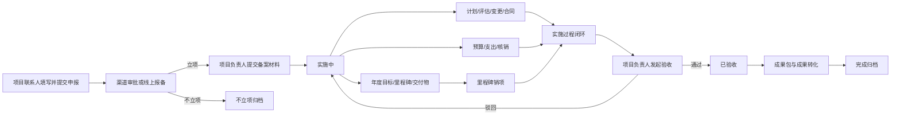

# 6008端口全流程人员职责与操作权限说明

> 梳理对象：AutoDL 服务器 6008 端口当前运行平台  
> 梳理日期：2026-09-10  
> 说明口径：以当前运行代码、运行数据库中的岗位权限矩阵及现有业务说明为依据。本文件中的“谁”优先指某个项目当前绑定的具体岗位人员，而不是固定姓名；人员调整后，责任随项目岗位绑定关系转移。

## 1. 文档目的

本文件回答五个问题：

1. 谁负责填写业务数据和上传材料；
2. 谁负责正式提交并启动流程；
3. 谁在什么节点审核；
4. 谁可以查看哪些数据；
5. 谁可以编辑哪些数据，以及编辑受到什么限制。

本文件描述的是当前平台的业务责任分工，不重新设计流程。实际能否操作由以下四层条件共同决定：

1. **登录身份的数据范围**：全公司、本单位、本人关联项目或仅经费范围；
2. **项目岗位办理权限**：当前人员在该项目担任什么岗位、获得哪些权限代码；
3. **流程节点指派**：审批只能由当前节点绑定的具体姓名和工号办理；
4. **项目和业务状态**：即使有权限，也只能在允许的状态、年度和前置条件下操作。

因此，“看得到页面”不等于“可以编辑”，“有某项权限”也不等于“可以替代当前审批人审核”。

## 2. 关键术语

| 动作 | 含义 |
|---|---|
| 填写 | 新建草稿、录入字段、选择人员、上传附件或补正材料，尚未必然启动审批 |
| 提交 | 将草稿正式送入审批或报备流程，并产生审批记录、当前节点和待办 |
| 审核 | 当前审批节点绑定人员作出通过、驳回等处理并填写意见 |
| 查看 | 在本人数据范围内查看项目页签、字段、附件、流程和审计记录，不包含修改权 |
| 编辑 | 修改尚未锁定的业务字段、维护业务清单或补充附件；已审批数据通常必须走变更流程 |
| 发起人 | 创建并提交当前业务流程的人；通常可以在允许状态下撤回、补正和重新提交 |
| 当前节点办理人 | 系统在流程创建时绑定的具体姓名和工号；只有此人或管理员技术兜底可以办理该节点 |

## 3. 人员与岗位体系

### 3.1 平台级登录身份

| 登录身份 | 默认数据范围 | 主要定位 |
|---|---|---|
| 公司领导 | 全公司 | 查看综合台账、驾驶舱、风险和统计，原则上只读 |
| 总部责任处室处长 | 全公司或责任范围 | 管理审签、监督、督办和台账管理 |
| 总部责任处室主管 | 全公司或责任范围 | 日常管理、材料审核、备案和督办 |
| 单位科技部长 | 本单位 | 单位科技管理、内部审核、岗位管理和督办 |
| 单位科技主管 | 本单位 | 单位项目日常管理、材料核验和流程协同 |
| 一级总师 | 经手项目 | 公司级专业技术审查和技术指导 |
| 二级总师 | 经手项目 | 单位级专业技术审查和技术指导 |
| 总部财务主管 | 总部项目经费 | 经费归集、复核、执行监管和拨付核对 |
| 单位财务部长 | 本单位项目经费 | 经费预算、支出和核销材料审核 |
| 单位财务主管 | 本单位项目经费 | 经费台账查看和辅助核对，原则上只读 |
| 项目负责人 | 本人关联项目 | 项目总体责任、备案、核销、验收和成果转化 |
| 技术负责人 | 本人关联项目 | 年度目标、里程碑、交付物和技术节点 |
| 项目主管 | 本人关联项目 | 计划、评估、变更和外协合同协同 |
| 项目联系人 | 本人关联项目 | 申报、材料组织、沟通和项目岗位维护 |
| 系统管理员 | 全平台 | 账号、权限、模板、表单和运维管理；不应替代业务责任人常态办理 |

### 3.2 项目内岗位

同一人员可在同一项目担任多个岗位，办理权限取并集。主要项目岗位包括：项目联系人、项目负责人、技术负责人、项目主管、一级总师、二级总师、总部责任处室处长、总部责任处室主管、单位科技部长、单位科技主管、总部财务主管、单位财务部长、单位财务主管。

## 4. 全生命周期总览

## 5. 全流程职责矩阵

| 流程阶段 | 谁填写 | 谁提交 | 谁审核 | 谁查看 | 谁编辑 | 完成结果 |
|---|---|---|---|---|---|---|
| 项目申报 | 项目联系人 | 项目联系人 | 按申报渠道配置的审批链；最终由立项结果办理人登记结果 | 项目团队、相关管理岗位、领导及管理员按数据范围查看 | 申报提交前由联系人修改；驳回后由发起人补正 | 进入立项中、不立项或保持申报中 |
| 立项备案 | 项目负责人上传备案支撑材料 | 项目负责人 | 科研归口管理部门当前节点人员 | 项目成员及相关管理人员 | 负责人在提交前或驳回后补充、替换材料 | 通过后进入实施中 |
| 基本信息补充 | 项目团队，通常由联系人、负责人或项目主管办理 | 具备发起审批权限的项目岗位人员 | 二级单位管理团队，总部管理团队确认/备案 | 所有具备该项目访问资格的人员 | 具备基本信息编辑权限者；审批后改动走变更 | 回写项目台账和成员表 |
| 年度目标与里程碑 | 技术负责人 | 技术负责人 | 二级单位科技部门 | 项目成员、管理人员和领导按范围查看 | 技术负责人编辑草稿；通过后原则上走增补或变更 | 写入年度目标、里程碑、交付物台账 |
| 交付物维护与交付 | 项目负责人或技术负责人 | 当前具备交付物办理权限的责任人 | 二级单位管理团队，总部管理团队确认 | 项目访问人员 | 负责人/技术负责人；已交付清单字段锁定 | 记录交付日期并归档原件/佐证 |
| 里程碑销项 | 项目团队责任人上传完成佐证 | 项目负责人、技术负责人或单位管理人员中具备销项权限且处于可办节点者 | 二级单位内部核验人员 | 项目访问人员 | 具备销项权限者补充佐证；已销项记录不可直接改 | 记录实际完成日期并关闭节点 |
| 计划填报/办结 | 项目主管 | 项目主管或具备计划管理权限者 | 二级单位管理团队 | 项目访问人员 | 项目主管在办结前维护 | 计划状态变为已完成 |
| 评估检查 | 项目主管、项目负责人或项目联系人按检查任务填报 | 具备评估填报权限的项目岗位人员 | 渠道规定的二级单位/总部管理节点；结论材料由具备评估归档权限的管理人员上传 | 项目团队、管理岗位、领导按范围查看 | 填报人在提交前或驳回后编辑；结论由指定管理岗位维护 | 形成检查结论；不合格则产生整改门槛 |
| 项目变更 | 项目负责人为主，联系人、技术负责人或项目主管可按权限协同 | 具备项目/数据变更权限的责任人 | 普通变更：二级单位初审、总部终审；重大变更增加法务；数据变更由单位审批、总部科技确认 | 项目访问人员 | 发起人在提交前或驳回后改；通过后系统自动回写 | 更新项目、里程碑、合同或交付物 |
| 外协合同登记 | 项目主管 | 项目主管或具备合同登记权限者 | 依合同/变更流程配置办理 | 项目团队、相关管理和财务人员 | 项目主管维护未锁定合同；关键变动走变更 | 写入合同及付款节点台账 |
| 年度经费预算 | 项目团队按已审批里程碑逐项填报 | 具备预算填报权限的项目岗位人员 | 单位财务部门审核，总部财务团队复核备案 | 项目团队可看本项目；财务按本单位/总部范围看 | 提交前或驳回后由预算填报人修改 | 预算生效并同步经费台账 |
| 经费使用与核销 | 项目负责人填写支出明细并上传每项凭证 | 项目负责人 | 单位财务部长 | 项目团队看本项目；单位/总部财务按范围查看 | 负责人在提交前或驳回后补正；财务只审核，不改项目原始凭证内容 | 增加已支出额，形成核销记录和凭证档案 |
| 总部科研经费拨付 | 二级单位在下达额度内填写拨付申请 | 二级单位授权经办人 | 总部科技部门审核，再由总部财务部门审核 | 相关单位、总部管理和财务人员 | 发起单位在提交前或退回后编辑；额度锁定后不可直接改 | 双审通过后更新已拨付金额 |
| 验收申请 | 项目负责人上传分级验收材料 | 项目负责人 | 二级单位管理团队初审；国家级增加责任总师复核；总部管理团队终审 | 项目团队、相关管理岗位、领导按范围查看 | 负责人在提交前或驳回后补正材料 | 通过后变为已验收；驳回退回实施中 |
| 协作单位评价 | 项目负责人 | 项目负责人 | 按评价/管理流程配置核验；异常评价可进入黑名单管理 | 项目团队、相关管理人员 | 具备协作评价权限者在时限内填写；提交后按规则锁定 | 形成五维评价和风险记录 |
| 成果包与成果转化 | 项目负责人选择已交付成果并填写转化信息 | 项目负责人或具备成果更新权限者 | 二级单位管理团队审核，总部管理团队备案 | 项目访问人员、管理岗位和领导按范围查看 | 项目负责人持续更新进展、实际日期和成效佐证 | 形成成果包并同步项目和交付物 |
| 项目完成归档 | 项目团队整理完整性材料 | 项目团队具备发起审批权限的责任人 | 二级单位管理团队完整性核验，总部管理团队归档确认 | 项目访问人员和管理人员 | 归档前由责任人补齐；归档后整体只读 | 项目状态变为已归档 |

## 6. 各阶段详细说明

### 6.1 项目申报：谁填、谁交、谁审

#### 填写人和填写内容

项目联系人负责组织并填写：

- 项目级别、申报渠道、项目类型、主管司局/处室；
- 项目名称、总体目标、年度目标；
- 起止日期、项目总经费和经费构成；
- 牵头工作、牵头单位、需求单位和参研/协作单位；
- 专业分类；
- 项目联系人、项目负责人、技术负责人、项目主管、总师、单位管理和财务岗位等具体姓名与工号；
- 里程碑和交付物初始信息（若当前渠道表单包含）；
- 渠道要求的申报书、论证材料及其他真实附件。

系统在提交时校验必填项、日期范围、经费、专业、人员资格、岗位完整性、重复项目和必传材料。

#### 提交人

项目联系人正式提交。审批型渠道生成申报审批；报备型渠道完成线上报备并归档。发起人可在允许状态下撤回；驳回后由发起人补正并重新提交。

#### 审核人

申报审批链由所选渠道决定。当前常规链路总体为：

1. 项目联系人提交；
2. 项目负责人审核；
3. 项目承担部门负责人审核；
4. 二级总师技术审核；
5. 单位财务部门负责人审核（部分渠道不含该节点）；
6. 单位科技部门负责人审核；
7. 单位分管领导审核；
8. 一级总师审核；
9. 总部科研项目处审核；
10. 审批结果办理人登记“立项”或“不立项”。

特殊渠道以运行配置为准，例如：

- 联盟类：项目团队提交申请书 → 联盟专委会审查 → 联盟理事会审查 → 总部科研项目处报批 → 审批结果；
- 研究院类：建设单位提交建议书 → 学术委员会评审 → 形成拟立项清单 → 理事会审议 → 审批结果；
- 报备类：项目联系人提交 → 系统线上报备归档，不走完整审批链；
- 科技周类：项目负责人 → 三级专业总师 → 二级专业总师 → 单位科技部门负责人 → 单位分管科技领导 → 总部科技发展处 → 一级总师 → 总部科技管理部 → 审批结果。

审批结果是独立权限，不能仅凭普通项目查看权办理。

### 6.2 立项备案

- **填写/上传**：项目负责人上传立项通知、任务书、任务流程、合同，以及渠道配置的附加备案材料。
- **提交**：项目负责人在项目处于“立项中”时提交，一个项目不得同时存在重复在途备案流程。
- **审核**：科研归口管理部门当前节点人员审核完整性和有效性。
- **驳回处理**：退回项目负责人补正附件并重新提交。
- **通过效果**：项目转为“实施中”，备案材料进入归档链路。

### 6.3 基本信息和项目成员

- 项目联系人、项目负责人、项目主管等具备 `baseinfo_edit` 权限的岗位补齐项目字段。
- 项目联系人、项目负责人、单位科技部长、单位科技主管等具备 `members_edit` 权限者，可在本项目中指定或转办岗位。
- 新任人员必须满足任职、组织、岗位和在岗资格；变更动作记录原人员、新人员、操作者和时间。
- 基本信息或岗位提交审批后，由二级单位管理团队审核、总部管理团队确认/备案，通过后回写正式台账。
- 已进入受控状态的数据不能靠直接编辑绕过审批，应发起项目变更或数据变更。

### 6.4 年度目标、里程碑和交付物

#### 年度计划

- **填写与提交**：技术负责人编制年度目标、里程碑名称、计划日期及交付物清单。
- **约束**：日期必须落在项目周期和所填年度内；每项交付物必须绑定本次里程碑；同类年度计划只能有一个在途审批。
- **审核**：二级单位科技部门当前节点人员。
- **通过效果**：正式写入年度目标、里程碑和交付物台账。

#### 交付物

- 项目负责人或技术负责人维护未交付清单并上传原件/佐证。
- 二级单位管理团队审核，总部管理团队确认。
- 通过后记录交付日期；已交付交付物的清单字段锁定，若要改变应走变更。

#### 里程碑销项

- 项目团队责任人上传节点完成佐证；具体可操作人员必须同时具备 `milestone_close` 且满足页面节点和状态校验。
- 提交前系统检查该节点所有绑定交付物是否已经完成；任一未完成则禁止销项。
- 二级单位内部核验人员审核，批准后记录实际完成日期和佐证。
- 超期节点不能直接修改计划日期，应走项目变更流程。

### 6.5 计划、评估和变更

#### 计划办结

项目主管填写并发起办结，由项目团队提交，二级单位管理团队终审。通过后计划标记为已完成并记录完成时间。

#### 评估检查

项目主管、项目负责人或项目联系人中具备 `assess_submit` 权限者，根据渠道和阶段填写检查申请、执行情况、问题和整改信息。二级单位或总部管理岗位审核；具备 `assess_archive` 权限的管理人员上传正式检查结论。若结论不合格，整改未闭环前会阻止验收。

#### 项目变更和数据变更

- 项目负责人为主要责任人，联系人、技术负责人和项目主管可按项目岗位权限协同填报。
- 填写变更类型、变更前后内容、原因、可自动执行的新值，并上传真实佐证。
- 普通变更：项目团队提交 → 二级单位主管部门初审 → 总部管理部门终审。
- 重大变更（外协方、经费、整体周期等）：在常规链路中增加法务合规审核。
- 数据变更：项目团队提交 → 二级单位内部审批 → 总部科技主管确认。
- 审批通过后由系统回写目标字段；审核人不应直接修改发起人提交的原始业务事实。

### 6.6 经费

#### 年度预算

1. 前置条件是本年度里程碑清单已经审批生效。
2. 项目团队中具备 `funds_submit` 权限者逐里程碑填报预算。
3. 系统校验单个节点金额大于零、合计不超过项目总经费。
4. 单位财务部门审核，总部财务团队复核备案。
5. 通过后预算才进入正式经费台账。

#### 使用明细和核销

1. 项目负责人选择年度和里程碑，逐项填写支出用途、金额、日期等明细。
2. 每项支出必须上传真实凭证。
3. 项目负责人提交，单位财务部长审核。
4. 系统校验节点剩余预算、在途金额和重复凭证。
5. 通过后增加已支出金额，写入核销记录并归档凭证。

单位财务主管的职责是查看、协助核对，不发起核销、不直接修改项目经费台账；总部财务主管负责归集、复核、异常监管和拨付核对，不修改科研业务内容。

#### 总部拨付

总部科技/财务下达年度总额和上限，二级单位授权人员提交申请，总部科技部门和总部财务部门依次审核。只有双审通过才能更新已拨付金额，任何单点操作都不能直接批准拨付。

### 6.7 验收

项目负责人发起前，系统必须同时确认：

- 所有里程碑已闭环销项；
- 所有核心交付物已交付；
- 经费预算已经生效，凭证完整，累计支出和归档核销金额一致，且没有在途核销；
- 所有不合格评估的整改已经闭环。

项目负责人按项目级别上传材料：

| 项目级别 | 必需材料 |
|---|---|
| 国家级 | 单位级验收材料、公司级验收材料、国家级验收材料 |
| 地方级 | 单位级验收材料、属地主管部门验收材料 |
| 公司级 | 单位级验收材料、公司级验收材料 |

审批链为：项目团队提交 → 二级单位管理团队初审 → 国家级项目增加责任总师技术复核 → 总部管理团队终审。审批期间系统会再次检查验收门槛；条件变化时流程锁定并要求整改。通过后项目进入“已验收”，驳回则退回“实施中”。

### 6.8 协作评价、成果转化和归档

#### 协作评价

项目负责人对参研或外协单位从技术、质量、进度、服务、合规五个维度评价。参研单位通常以项目验收日为起点，外协单位以合同验收日为起点，要求在规定时限内完成。异常评价进入管理核验和风险/黑名单处理。

#### 成果转化

项目验收后，项目负责人从已交付且未绑定成果包的交付物中选择成果，建立成果包并填写向型号或向市场转化信息、计划日期。二级单位管理团队审核，总部管理团队备案。备案后，负责人持续更新转化进展，完成时填写实际日期并上传成效佐证。

#### 完成归档

只有在验收完成、至少存在一个成果包、全部已交付成果均已纳入成果包、成果包审核备案完结且全部转化完成并有佐证时，项目团队才能提交完成归档。二级单位管理团队核验完整性，总部管理团队确认归档；通过后项目变为“已归档”并整体只读。

## 7. 谁可以查看什么

### 7.1 查看范围

| 人员 | 查看范围 |
|---|---|
| 公司领导 | 全公司项目、综合统计、风险、驾驶舱；以查看为主 |
| 总部责任处室处长/主管 | 全公司或责任处室范围内的项目、审批、成果和预警 |
| 单位科技部长/主管 | 本单位项目、审批、成果、预警和管理信息 |
| 一级/二级总师 | 本人被指派或经手的项目、技术材料和待审节点 |
| 项目联系人/负责人/技术负责人/项目主管 | 本人被列入项目成员或岗位的项目 |
| 总部财务主管 | 总部范围的预算、支出、核销和拨付数据，并可从经费视角查看项目 |
| 单位财务部长/主管 | 本单位项目经费数据；不因此获得科研业务修改权 |
| 系统管理员 | 全平台，用于配置、排障和运维审计 |

### 7.2 进入项目后始终可见

只要人员已具备该项目访问资格，就可以查看以下页签：概览、里程碑、计划、经费、交付物、协作评价、成果转化、审批与归档、项目可视化。

概览中的项目目标、年度目标、项目渠道、渠道流程、成果转化状态和协作单位也始终可见。这里的“始终可见”仅表示只读可见，不代表具有修改权。

## 8. 谁可以编辑什么

以下为6008运行环境在梳理日保存的项目岗位权限矩阵。它反映“该岗位可能办理哪些动作”，实际操作还必须满足流程节点、项目状态、数据范围和接口的专项校验。

| 项目岗位 | 当前允许的编辑/发起能力 |
|---|---|
| 项目联系人 | 基本信息、里程碑计划、里程碑销项、经费预算、成果转化、申报、备案材料、发起审批/上传材料、评估填报、项目/数据变更、项目成员岗位 |
| 项目负责人 | 基本信息、里程碑计划、里程碑销项、经费预算、经费使用与核销、协作评价、成果转化、备案材料、发起审批/上传材料、评估填报、项目/数据变更、验收申请、项目成员岗位 |
| 技术负责人 | 基本信息、里程碑计划、里程碑销项、交付物维护/交付、发起审批/上传材料、项目/数据变更 |
| 项目主管 | 基本信息、计划填报/办结、发起审批/上传材料、评估填报、项目/数据变更、外协合同登记 |
| 一级总师 | 当前项目矩阵不授予直接编辑项；审核权由具体流程节点指派产生 |
| 二级总师 | 当前项目矩阵不授予直接编辑项；审核权由具体流程节点指派产生 |
| 总部责任处室处长 | 上传评估结论/检查材料 |
| 总部责任处室主管 | 上传评估结论/检查材料 |
| 单位科技部长 | 里程碑销项、发起审批/上传材料、评估结论/检查材料、项目成员岗位 |
| 单位科技主管 | 里程碑销项、评估结论/检查材料、项目成员岗位 |
| 总部财务主管 | 经费预算相关办理；实际动作还受总部财务流程限制 |
| 单位财务部长 | 经费预算、经费使用/核销材料相关办理，并审核单位核销流程 |
| 单位财务主管 | 经费使用/核销材料相关协同；正式职责以查看和核对为主，不能越过节点审批 |

特别说明：

- 审批权不在上表中简单授予。一级总师、二级总师、管理和财务人员即使没有项目直接编辑项，只要被绑定为当前审批节点，仍可审核该节点。
- 运行环境矩阵可由管理员修改；修改后以运行数据库的最新配置为准，并应记录审计日志。
- 管理员在后端具备技术兜底能力，但正式业务不应由管理员代替项目责任人、财务或技术审查人员办理。

## 9. 审核的硬性规则

1. 每次流程创建时，除发起节点和系统结果节点外，审批节点必须解析为具体姓名和工号；找不到合格人员时禁止提交。
2. 发起节点在提交后标记为已完成，下一节点成为当前节点。
3. 只有当前节点绑定人员或管理员技术兜底可办理；仅拥有同名角色、看到审批菜单或能查看项目，都不能越权审核。
4. 通过后系统计算下一节点；最终通过时才执行项目状态、经费、里程碑、成果包或变更数据的业务回写。
5. 驳回必须填写意见，并将关联业务退回到可补正状态或按流程规则恢复项目状态。
6. 发起人只可在允许状态下撤回；撤回、补充附件、重新提交和委托均需要留下记录。
7. 每次提交、审核、驳回、撤回、转办和数据回写均应记录操作者、工号、时间、节点、意见和附件。

## 10. 编辑边界和禁止事项

- 已审批生效的数据不能通过普通编辑直接覆盖，应走项目变更或数据变更。
- 已交付交付物不能直接修改清单字段。
- 里程碑存在未完成绑定交付物时不能销项。
- 超期里程碑不能直接改计划日期，应走变更。
- 经费核销由项目负责人提交，财务审核人不能代替负责人填写业务事实或篡改原凭证。
- 验收前置条件不满足时，即使负责人有验收权限也不能提交。
- 已归档项目原则上整体只读。
- 财务人员的经费查看范围不自动扩展为科研业务编辑权限。
- 公司领导以查看和决策信息使用为主，不承担日常填报和直接编辑。
- 系统管理员不得以运维权限常态替代项目、技术、管理、财务人员办理正式业务。

## 11. 实际使用时如何确定“谁”

对任一具体项目，应按以下顺序确定实际责任人：

1. 在项目成员中找到该岗位当前绑定的具体姓名和工号；
2. 检查该人员是否在岗、组织和任职是否满足资格；
3. 检查项目岗位矩阵是否包含所需动作；
4. 检查项目状态、年度、材料和前置条件是否允许；
5. 若为审批，必须再检查审批记录中的“当前节点办理人”是否就是该人员；
6. 操作完成后核对审批记录、业务台账、附件归档和审计日志是否一致。

可概括为：

> 填写人由项目岗位和办理权限决定；提交人由业务责任与发起权限决定；审核人由流程当前节点的具体指派决定；查看人由登录身份数据范围和项目关联决定；编辑人由项目岗位权限、业务状态和接口校验共同决定。

## 12. 核对清单

- [ ] 项目联系人可以完整填写和提交申报，其他无权人员不能越权提交。
- [ ] 各申报渠道加载正确的材料清单和审批链。
- [ ] 每个审核节点都绑定具体姓名和工号，不使用空角色占位。
- [ ] 项目负责人可以办理备案、核销、验收和成果转化。
- [ ] 技术负责人可以编制年度目标、里程碑和交付物。
- [ ] 项目主管可以办理计划、评估、变更和合同范围内事项。
- [ ] 里程碑、交付物、经费和整改共同构成验收门槛。
- [ ] 单位财务部长审核核销，总部财务主管归集复核，单位财务主管不越权修改。
- [ ] 领导、管理、财务和项目人员只能看到各自数据范围。
- [ ] 可查看项目页签不等于可以编辑。
- [ ] 驳回、撤回、转办、补正和重新提交均有完整审计记录。
- [ ] 已生效、已交付、已验收和已归档数据的锁定及变更规则生效。

---

**结论：**6008平台中的责任分工不是单纯按页面按钮或登录角色判断，而是围绕项目全生命周期，将项目岗位、审批节点、数据范围和业务状态组合使用。任何后续改造或与6006平台合并，都应保留这四层判断以及每个流程的原始责任人、材料要求、审核链和业务回写效果。
