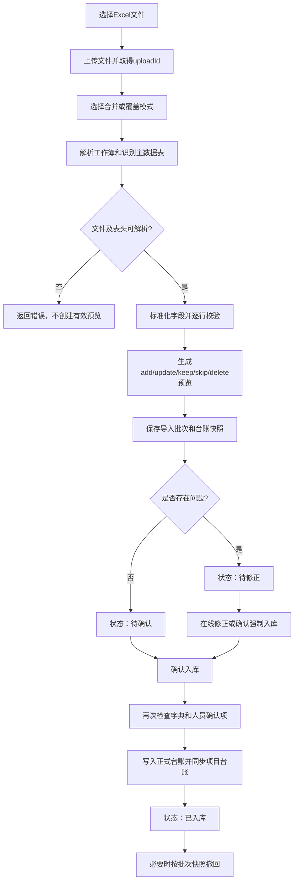

# 6008端口表格导入预校验功能说明

## 1. 文档信息

- 文档对象：6008端口“表单维护—表格批量上传”功能
- 运行技术：React 前端、Node.js + Express 后端、SQLite 数据库
- 编写依据：6008端口当前运行代码与接口实现
- 核心原则：表格上传后先解析并形成预校验批次，用户确认前不写入项目业务台账

> “不写入业务台账”是指预校验阶段不改动正式台账记录。系统仍会保存上传文件、导入批次、预览结果、原台账快照和审计记录，以便后续确认、取消和追溯。

## 2. 功能目标

表格导入预校验用于在批量数据进入项目台账前完成以下工作：

1. 校验上传文件类型、大小及工作簿规模。
2. 自动识别总表或项目类型分表，解析不同层级表头。
3. 将Excel列映射成平台标准字段并进行数据标准化。
4. 检查必填项、经费关系、项目周期、专业字典及项目类型级联路径。
5. 检查用户是否有权导入对应范围的数据。
6. 识别新增、更新、无变化、跳过及覆盖删除记录。
7. 识别待新增渠道、项目类型、级联路径和成员。
8. 在正式入库前提供逐行问题查看及在线修正。
9. 支持取消批次、确认入库、强制入库、问题行标记及入库后整批撤回。

## 3. 适用角色与权限

### 3.1 访问权限

满足下列任一条件的用户可以使用表单上传及预校验：

- 系统管理员；
- 成员管理中已开启“表单维护权限”的用户。

未授权用户调用上传预校验接口时返回403，并提示联系系统管理员授权。

### 3.2 数据范围

非管理员用户只能处理其表单维护授权范围内的记录：

| 授权范围 | 允许处理的数据 |
|---|---|
| 总部全部台账 | 全部项目记录 |
| 本单位 | 责任单位、需求单位、司局/处室或牵头工作中匹配本单位的记录 |
| 指定渠道 | 项目来源/渠道与授权渠道匹配的记录 |
| 指定项目类型 | 项目类型与授权类型匹配的记录 |
| 仅本人 | 负责人或最近维护人包含当前用户姓名的记录 |

超出授权范围的导入行在预校验中标记为`skip`，不会正常入库。

### 3.3 覆盖导入权限

只有以下用户可以使用“覆盖导入总表”模式：

- 系统管理员；
- 具有“总部（全部台账）”表单维护范围的用户。

其他用户只能使用“上传分表（合并）”模式。

## 4. 总体业务流程



## 5. 文件上传要求

### 5.1 支持格式

- 支持：`.xlsx`、`.xls`；
- 不支持CSV、PDF、Word及图片直接作为台账导入文件；
- 文件必须先通过通用上传接口存入平台文件库，再使用返回的`uploadId`发起预校验。

### 5.2 文件大小与工作簿规模

| 检查项 | 当前限制 | 超限处理 |
|---|---:|---|
| 单个上传文件 | 40 MB | 上传失败 |
| 工作表数量 | 100个 | 拒绝解析整个工作簿 |
| 单个工作表行数 | 20,000行 | 拒绝解析整个工作簿 |
| 单个工作表列数 | 120列 | 拒绝解析整个工作簿 |
| 工作簿总单元格数 | 800,000个 | 拒绝解析整个工作簿 |

### 5.3 文件有效性检查

- `uploadId`不存在：返回404；
- 上传记录存在但物理文件已被清理：返回410；
- 文件扩展名不是`.xlsx`或`.xls`：返回400；
- 工作簿不能被XLSX解析器读取：返回400并携带解析错误；
- 没有解析到有效项目行：返回400，并提示检查表头及数据起始行。

## 6. 工作表和表头识别

### 6.1 表头定位

系统逐个工作表查找同时包含“项目类型”和“项目名称”的行，并将该行识别为主要字段表头。

- 未找到表头的工作表会被跳过；
- 普通工作表会记录“未识别到表头”的问题；
- 名为`Sheet2`、`Sheet3`的空白辅助页缺少表头时不产生问题提示；
- 表头文本会去除空格，并将半角括号统一为全角括号后再匹配；
- 支持分组表头、子表头和字段表头三层取值。

### 6.2 必要表头

以下字段属于必要字段。如果工作表缺少对应列，整个工作表拒绝导入：

1. 级别；
2. 项目来源/渠道；
3. 项目类型；
4. 一级专业；
5. 二级专业；
6. 项目名称；
7. 责任单位；
8. 项目状态；
9. 总经费（万元）。

必要列存在但某一数据行未填写时，该行进入预览，但被标记为校验问题和`skip`。

### 6.3 数据起始行

- 如果表头下一行的“项目类型”和“项目名称”位置已有数据，则下一行直接作为首条数据；
- 否则跳过一行子表头，从表头后第二行开始读取；
- 全空行和“填写说明”行不作为数据行；
- 只要任一标准字段有值，该行就会进入解析范围。

### 6.4 多工作表选择顺序

系统按以下优先级选择导入数据：

1. 优先选择名为“总表”“预先研究项目信息”“预研项目信息”或`Sheet1`的非空工作表；
2. 其次选择名称中包含“总表”的非空工作表；
3. 只有一个可解析工作表时，使用该工作表；
4. 首个有效工作表名称包含“总表”“汇总”或“台账”时，只使用该表；
5. 其余明确的多分表工作簿会合并所有可解析分表。

该规则用于避免同时导入“总表+分表”而造成重复。

## 7. 标准字段说明

### 7.1 项目基本信息

| 字段 | 必填 | 类型/处理规则 |
|---|---|---|
| 序号 | 否 | 优先作为项目唯一标识 |
| 级别 | 是 | 只允许国家级、地方级、公司级 |
| 项目来源/渠道 | 是 | 参与级联路径校验 |
| 司局/处室 | 否 | 支持“司局／处室”“司局处室”“管理司局/处室”等表头 |
| 项目类型 | 是 | 参与主表识别、分表分类和级联路径校验 |
| 一级专业 | 是 | 必须存在于专业字典 |
| 二级专业 | 是 | 必须隶属于所选一级专业 |
| 项目名称 | 是 | 无序号时参与生成唯一标识 |
| 管理/需求单位 | 否 | 用于范围判断和项目同步 |
| 责任单位 | 是 | 无序号时参与生成唯一标识 |
| 项目状态 | 是 | 项目当前状态 |
| 验收状态 | 否 | 项目验收状态 |
| 负责人 | 否 | 兼容“中国商飞内部负责人”表头，并用于识别未知人员 |
| 项目立项年月 | 否 | 建议采用`YYYY-MM`格式 |
| 项目开始年月 | 否 | 与结束年月进行先后关系检查 |
| 项目结束年月 | 否 | 不得早于开始年月 |
| 项目周期 | 否 | 文本或数值按原值导入 |

### 7.2 经费信息

| 字段 | 必填 | 类型/处理规则 |
|---|---|---|
| 总经费（万元） | 是 | 数值，且必须大于0 |
| 国拨经费（万元） | 否 | 数值，空值按0参与总额关系校验 |
| 其中商飞内部单位国拨经费（万元） | 否 | 不得大于国拨经费 |
| 自筹经费（万元） | 否 | 数值，空值按0参与总额关系校验 |
| 其中商飞内部单位自筹经费（万元） | 否 | 不得大于自筹经费 |
| 累计支出（万元） | 否 | 数值 |
| 2026年预算（万元） | 否 | 数值 |
| 2026年实际执行经费（万元） | 否 | 可解析字段，不属于当前标准台账导出列 |
| 2026年预算执行率 | 否 | 有预算和实际执行额但未填时产生建议提示 |
| 已结题项目实际执行经费（万元） | 否 | 数值 |
| 已结题项目国拨经费执行（万元） | 否 | 数值 |
| 已结题项目自筹经费执行（万元） | 否 | 数值；兼容“已结题项目国自筹经费执行（万元）” |
| 已结题项目经费执行率 | 否 | 兼容“执行率”表头 |

### 7.3 成果转化信息

| 字段 | 必填 | 类型/处理规则 |
|---|---|---|
| 产生成果数量 | 否 | 数值 |
| 生成成果名称 | 否 | 兼容“产生成果名称”表头 |
| 已转化数量 | 否 | 数值 |
| 转化成果名称 | 否 | 文本 |
| 转化年份 | 否 | 兼容“转化年月”表头 |
| 转化型号 | 否 | 文本 |
| 技术成熟度数量 | 否 | 数值；兼容“技术储备数量”表头 |
| 储备成果名称 | 否 | 文本 |
| 预计转化年度 | 否 | 年度文本 |
| 备注 | 否 | 文本 |

数字单元格解析时会自动去除英文逗号、`万元`后缀和末尾百分号。无法转换为有限数字的值会被标准化为空值。

## 8. 逐行预校验规则

### 8.1 必填校验

逐行检查第6.2节列出的9个必填字段。问题显示格式为“字段名必填”。只要存在缺失字段，该行`validation.ok=false`。

### 8.2 经费校验

1. 总经费必须为有效数字；
2. 总经费必须大于0；
3. 总经费必须等于“国拨经费+自筹经费”，允许0.01万元以内的浮点误差；
4. 不相等时显示差额及方向，例如“总经费比合计多”或“国拨与自筹合计比总经费多”；
5. 商飞内部单位国拨经费不得大于国拨经费；
6. 商飞内部单位自筹经费不得大于自筹经费；
7. 已填2026年预算和实际执行经费但未填预算执行率时，提示建议补充。

注意：内部国拨和内部自筹属于对应经费的“其中数”，不重复加入总经费求和。

### 8.3 枚举与级联字典校验

- 级别只能是国家级、地方级或公司级；
- “级别—项目来源/渠道—司局/处室—项目类型”必须能在平台级联配置中找到合法路径；
- 只填写项目类型但无法反查到司局路径时，提示“项目类型未配置司局路径”；
- 如果该组合被识别为本批次待新增字典项，预校验暂不按非法路径阻断，但确认入库时必须明确同意写入字典。

### 8.4 专业校验

- 一级专业必须存在；
- 二级专业必须存在；
- 二级专业必须隶属于所选一级专业；
- 专业问题统一归入“专业”问题类别。

### 8.5 日期关系校验

- 同时填写开始年月和结束年月时，开始年月不得晚于结束年月；
- 当前实现主要比较年月字符串的前7位，建议模板统一采用`YYYY-MM`，避免非标准日期格式产生误判；
- 当前实现未对所有日期字段执行严格的正则格式校验。

### 8.6 唯一标识与批次内重复

项目唯一标识按以下顺序生成：

1. 有序号时：使用标准化后的序号；
2. 无序号但有项目名称时：使用“项目名称+项目来源/渠道+责任单位”；
3. 生成标识时去除空格并转为小写。

如果无法生成唯一标识，该行跳过。同一批次出现相同唯一标识时，首次记录保留，后续记录标记为项目唯一性冲突并跳过。

### 8.7 人员识别

- 系统从“负责人”字段中识别人员；
- 多人可用顿号、逗号、分号、斜杠或竖线分隔；
- 支持“姓名”“姓名（六位工号）”或含六位工号的文本；
- 平台成员名录无法匹配的人员进入`pendingPeople`待确认列表；
- 确认新增成员时，未提供有效六位工号的人员由系统从`200001`起分配可用工号；
- 新增人员默认作为项目团队成员，初始密码为工号，首次使用后应修改密码；
- 用户也可以选择强制入库但不写入成员名录。

### 8.8 问题分类

预校验将问题归入以下类别，便于筛选：

| 类别 | 典型问题 |
|---|---|
| 必填 | 字段为空、缺少项目名称 |
| 经费 | 总经费与国拨、自筹不相等，分项超过上级金额 |
| 数值 | 字段不是有效数字 |
| 日期 | 年月或年度格式、先后关系问题 |
| 字典 | 渠道、项目类型、级联路径不存在 |
| 专业 | 一级、二级专业不合法或不匹配 |
| 其他 | 权限范围、唯一性冲突等未归入上述类别的问题 |

## 9. 预览动作判定

每个解析行会被标记为以下动作之一：

| 动作 | 含义 | 确认后的处理 |
|---|---|---|
| `add` | 台账中不存在相同唯一标识，且校验通过 | 新增记录 |
| `update` | 已存在相同唯一标识，且标准字段发生变化 | 更新原记录并保留原记录ID |
| `keep` | 已存在相同唯一标识，但标准字段无变化 | 不修改台账 |
| `skip` | 校验失败、超出权限、无唯一标识或批次内重复 | 默认不入库 |
| `delete` | 覆盖模式下，原台账存在但上传文件中不存在 | 确认后删除；仅完整覆盖权限用户可产生 |

更新行同时返回字段级差异，包括字段名称、修改前值和修改后值。

## 10. 预校验统计与批次状态

### 10.1 统计指标

每个批次记录以下统计：

- `parsed`：预览动作总行数；
- `added`：预计新增行数；
- `updated`：预计更新行数；
- `skipped`：预计跳过行数；
- `issue_count`：存在问题或被跳过的行数。

覆盖模式下，`parsed`可能包含系统追加的`delete`预览行，因此可能大于上传文件实际解析行数；批次数据库中的初始`parsed`记录的是上传文件解析行数。

### 10.2 状态流转

| 状态 | 进入条件 | 可执行操作 |
|---|---|---|
| 待修正 | `issue_count > 0` | 查看、在线修正、取消、强制确认 |
| 待确认 | 不存在问题 | 查看、确认、取消 |
| 已取消 | 用户取消待处理批次 | 只读留痕 |
| 已入库 | 完成确认并写入台账 | 查看、导出、撤回本批 |
| 已撤回 | 使用入库前快照恢复 | 只读留痕 |

## 11. 在线修正

待确认或待修正批次支持逐行在线编辑。保存单行修正时，系统会重新执行：

1. 字段标准化；
2. 必填、经费、字典、专业和日期关系校验；
3. 数据范围权限检查；
4. 项目唯一标识计算；
5. 与现有台账的字段差异计算；
6. 待新增渠道、项目类型和人员重新识别；
7. `add/update/keep/skip`动作重新判定；
8. 批次统计和“待修正/待确认”状态重新计算。

已经取消、入库或撤回的批次不能继续在线修正。

## 12. 确认入库规则

### 12.1 正常确认

不存在问题行时，用户可以直接确认。系统按预览动作写入台账：

- 执行`add`和`update`；
- 忽略`keep`和`skip`；
- 覆盖模式执行`delete`；
- 写入前生成台账快照；
- 写入后记录批次状态、确认时间、确认人和变更日志；
- 将表单台账数据同步到项目台账，新建或更新对应项目。

### 12.2 强制入库

存在问题行时，默认返回422并阻止确认。用户明确勾选“已知晓问题仍确认入库”后，可以强制处理部分`skip`行。

以下问题不能强制入库：

- 缺少项目名称或无法生成项目唯一标识；
- 同一批次项目唯一性冲突。

强制入库记录会保留：

- `forceImported=true`；
- 原问题说明`forceImportIssue`；
- 可选的问题行颜色标记，支持红、黄、蓝，默认黄色；
- 是否已标记字段`forceImportMarked`。

### 12.3 新渠道和新项目类型确认

如果存在`pendingChannels`，用户必须先确认是否写入下拉字典：

- 新渠道：新增渠道及首个项目类型；
- 已有渠道的新类型：向渠道增加项目类型；
- 已有渠道和类型的新司局路径：补充级联路径。

新增结果同步到配置中心和全平台级联字典，并记录审计日志。

### 12.4 新人员确认

如果存在`pendingPeople`，用户必须选择：

- 确认写入成员名录；或
- 强制入库，仅保存项目中的负责人文本，不新增成员账户。

未作选择时返回422并阻止入库。

## 13. 合并与覆盖模式

### 13.1 合并模式（merge）

- 保留现有台账中未出现在上传文件里的记录；
- 新标识产生`add`；
- 已有标识且有差异产生`update`；
- 已有标识且无差异产生`keep`；
- 不会因为上传文件缺少某条记录而删除原台账。

### 13.2 覆盖模式（replace）

- 仅完整权限用户可用；
- 上传文件中的记录按新增或更新处理；
- 现有台账中未出现在上传文件里的记录产生`delete`；
- 确认时以本批数据重建台账内容；
- 风险显著高于合并模式，操作前必须仔细核对删除预览。

## 14. 取消、导出与撤回

### 14.1 取消批次

“待确认”或“待修正”批次可以取消。取消只修改批次状态，不会改动业务台账。

### 14.2 导出修正结果

批次可导出为Excel：

- 导出`add`、`update`和`keep`对应的数据行；
- 排除`skip`和`delete`行；
- 使用平台标准台账模板生成文件；
- 可用于线下复核、再次修改和重新上传。

### 14.3 撤回已入库批次

已入库批次可使用上传时保存的`snapshot_json`恢复导入前台账：

1. 撤回前再次生成安全快照；
2. 用本批入库前快照替换当前表单台账；
3. 批次状态改为“已撤回”；
4. 本批变更日志标记为已撤回。

注意：该操作按完整快照恢复。如果该批入库后又发生其他台账修改，撤回可能同时覆盖后续修改，实际操作前应先备份并确认影响范围。

## 15. 接口说明

6008端口后端统一挂载在`/api`路径下。

| 方法 | 接口 | 用途 |
|---|---|---|
| POST | `/api/uploads` | 以`multipart/form-data`上传文件，字段名为`file`，返回`uploadId` |
| POST | `/api/transition-tool/import-upload` | 根据`uploadId`和`mode`解析文件、执行预校验并创建批次 |
| GET | `/api/transition-tool/import-batches/{id}` | 获取批次详情、逐行预览和级联字典 |
| POST | `/api/transition-tool/import-batches/{id}/rows/{rowId}` | 在线修正单行并重新校验 |
| POST | `/api/transition-tool/import-batches/{id}/cancel` | 取消待处理批次 |
| POST | `/api/transition-tool/import-batches/{id}/confirm` | 确认或强制确认入库 |
| POST | `/api/transition-tool/import-batches/{id}/undo` | 撤回已入库批次 |
| GET | `/api/transition-tool/import-batches/{id}/export.xlsx` | 导出批次可用数据行 |

`import-upload`请求示例：

```json
{
  "uploadId": 123,
  "mode": "merge"
}
```

`confirm`请求可选参数示例：

```json
{
  "forceDespiteIssues": false,
  "markIssueRows": false,
  "issueMarkColor": "yellow",
  "confirmNewChannels": true,
  "confirmNewPeople": true,
  "people": []
}
```

## 16. 数据留痕

| 数据位置 | 保存内容 |
|---|---|
| `uploads` | 原文件名、存储文件名、大小、上传人和上传时间 |
| `server/data/uploads` | 上传文件物理内容 |
| `transition_import_batches` | 批次状态、统计、逐行预览、待确认字典/人员和入库前快照 |
| `transition_change_logs` | 新增、更新、删除及字段级前后值 |
| `audit` | 上传预校验、在线修正、确认、取消、撤回和字典新增操作 |
| `kv: transition.records.v19` | 正式表单台账数据 |
| `server/backups` | 台账关键操作前的备份文件 |

## 17. 前端页面应展示的信息

预校验页面应至少展示：

1. 文件名、上传人、上传时间和导入模式；
2. 批次状态；
3. 解析、新增、更新、跳过和问题数量；
4. 每行Excel行号、项目类型、项目名称和预览动作；
5. 必填缺失项、警告内容和问题类别；
6. 更新记录的字段级前后差异；
7. 待新增渠道、项目类型、司局路径及其涉及的项目和原表行号；
8. 待新增人员、识别出的姓名/工号、涉及项目和原表行号；
9. 在线修正入口；
10. 正常确认、强制入库、问题行颜色标记、取消、导出修正表和撤回本批入口。

## 18. 典型错误提示

| 场景 | HTTP状态 | 提示方向 |
|---|---:|---|
| 未登录 | 401 | 要求登录 |
| 无表单维护权限 | 403 | 联系管理员授权 |
| 无权覆盖总表 | 403 | 改用合并导入 |
| 上传文件不存在 | 404 | 重新上传 |
| 物理文件已清理 | 410 | 重新上传 |
| 格式、规模或表头错误 | 400 | 修正工作簿后重新上传 |
| 存在校验问题但未选择强制入库 | 422 | 在线修正或确认强制入库 |
| 存在未知字典但未确认 | 422 | 确认新增字典 |
| 存在未知人员但未选择处理方式 | 422 | 新增成员或强制仅写项目 |

## 19. 验收标准

### 19.1 正常场景

- 合法模板可成功上传并形成“待确认”批次；
- 新项目显示为新增，已有变化项目显示为更新，无变化项目显示为保持；
- 未确认前正式台账内容不发生变化；
- 确认后台账、项目台账、变更日志和审计日志同步更新。

### 19.2 异常场景

- 缺少必要表头的工作表被拒绝；
- 必填缺失、经费不平、专业不匹配和非法级联路径能准确提示；
- 批次内重复项目仅保留首条，其余跳过；
- 无权限数据行不会正常入库；
- 未确认的新字典和新人员不会被静默创建；
- 不可强制的问题即使选择强制入库也不会写入。

### 19.3 可恢复性

- 取消预校验批次不会改变正式台账；
- 已入库批次具备导入前快照；
- 批次撤回后台账可恢复到该批确认前状态；
- 所有关键操作均能在审计记录中查询到操作人和操作时间。

## 20. 当前实现边界与注意事项

1. 日期字段当前以字符串关系检查为主，模板应统一使用`YYYY-MM`。
2. 除总经费外，部分数字字段中的非法文本会在解析时转为空值，建议前端同时展示原始单元格值供复核。
3. 项目唯一性优先使用“序号”；如果不同项目误用相同序号，会被视为同一项目。
4. 未填写序号时，项目名称、渠道或责任单位的调整可能使系统将原项目识别为新项目。
5. 未知人员识别当前主要读取“负责人”字段，不会自动扫描所有文本字段。
6. 强制入库是例外处理，应保留问题说明并启用颜色标记，后续完成数据治理。
7. 覆盖导入可能产生批量删除，必须确认`delete`列表后再执行。
8. 批次撤回采用整体快照恢复，应评估该批入库后的其他修改是否会被覆盖。

